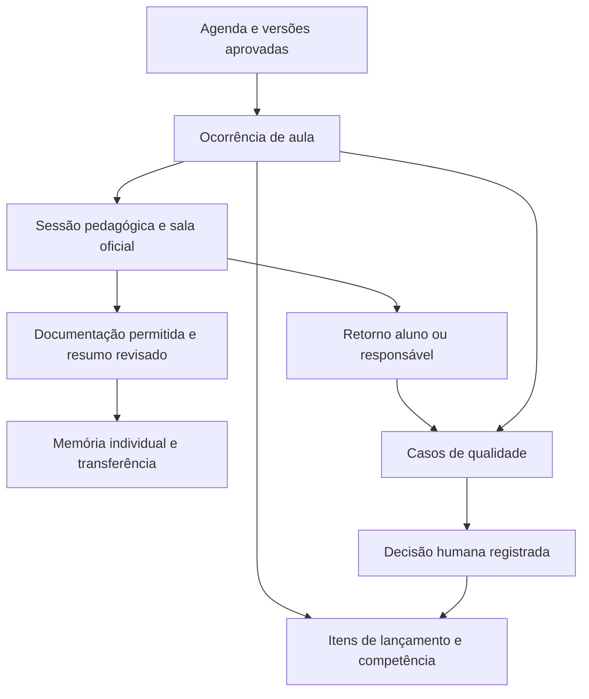

# Plano de qualidade, lançamento de aulas e continuidade pedagógica

Data: 12/09/2026. Base de código: `e3a1d913d7f5ef119f6b8eafc439e0b02cef2b01`, branch `codex/wolfie-standalone-funnel`.

Escopo: auditoria estática de componentes, funções, migrations, testes e fluxo de publicação; pesquisa na documentação oficial do Google. Não houve consulta aos registros de professores/alunos, teste de carga, criação de conta, envio de mensagens ou mudança na produção. Os relatos do proprietário orientam requisitos, não constituem constatações sobre pessoas nesta auditoria.

## 1. Decisão recomendada

Construir uma operação de qualidade baseada em aula identificada, agenda preservada, retorno independente da família e histórico pedagógico revisado. Integrar o Google Meet como candidato para sala institucional e documentação das aulas, com uma conta Workspace central organizadora e professores usando seus próprios Gmails como coanfitriões, conforme solicitado pelo proprietário.

O projeto tem três frentes que podem avançar separadamente:

1. Controles da própria escola: mudanças de agenda com aceite, destinatário da auditoria protegido, lançamento explícito, acompanhamento de reclamações e transferência pedagógica.
2. Meet para realização e documentação: sala oficial, transcrição, notas e importação para o histórico individual, dentro das finalidades permitidas.
3. Verificação automática de entrada/duração para avaliação docente: requisito condicionado à validação de uso com o Google, ou à escolha de um provedor que autorize expressamente essa finalidade.

### Restrição relevante encontrada na documentação

A visão geral da API diz: “The Meet REST API isn't intended for performance tracking or user evaluation within your domain.” O texto também orienta a não coletar dados para essa finalidade. [Documentação oficial da API](https://developers.google.com/workspace/meet/api/guides/overview).

O objetivo de medir atraso, reincidência e desempenho de professores se aproxima diretamente dessa restrição. A configuração com professores externos em Gmail pessoal não deve ser interpretada como exceção automática. Antes de contratar ou desenvolver essa parte, obter posicionamento aplicável ao caso concreto: conta central, professores externos, aulas individuais, documentação pedagógica e avaliação de prestação do serviço.

Enquanto esse ponto não estiver resolvido, não colocar dados da API do Meet em scorecards docentes, punições ou decisões de remuneração. Os controles de agenda, relatos voluntários e casos internos de qualidade continuam tendo valor independentemente disso. Se o Google não admitir o uso pretendido, o requisito de prova automática exige outro fornecedor/contrato; mudar apenas o nome do recurso para “qualidade” não resolve a questão.

## 2. Uma conta central e o Google AI Pro atual

| Necessidade | Situação verificada | Decisão para o projeto |
| --- | --- | --- |
| Testar notas do Gemini com o AI Pro já contratado | Google anunciou notas no Meet para AI Pro/Ultra em 29/06/2026, nas reuniões organizadas pelo assinante | É possível começar avaliando a qualidade das notas com a conta atual, sem assumir os demais recursos |
| Transcrição independente e coanfitriões | Documentação relaciona esses recursos ao Workspace Business Standard e superiores; o quadro Google One não lista o mesmo conjunto | Conta central Business Standard é a candidata inicial |
| Professor em Gmail pessoal | Coanfitriões externos são contemplados nos controles de reunião; organizador configura a sala | Validar antecipadamente o papel de cada professor e sua entrada sem a presença da matriz |
| Muitas aulas simultâneas | Uma sala admite uma conferência ativa; não encontrei garantia oficial de escala ilimitada de notas/transcrições simultâneas por uma licença | Salas distintas e teste no pico real de simultaneidade; confirmação comercial antes de escala |
| Notas automáticas | A configuração depende do organizador; início automático depende de anfitrião/coanfitrião entrando na web | Piloto deve reproduzir professor Gmail externo em computador, matriz ausente e aluno entrando primeiro |
| Relatório nativo de presença | É um recurso distinto das sessões de participantes da API e das notas; Business Plus inclui controle de presença | Não comprar Standard supondo que inclui o relatório nativo de Plus; validar a necessidade e o uso permitido |

Fontes: [anúncio do AI Pro](https://blog.google/products-and-platforms/products/workspace/take-notes-for-me/), [recursos Google One/Workspace](https://support.google.com/meet/answer/10459644?hl=en-GB), [coanfitriões](https://support.google.com/meet/answer/10885841?hl=en-AO), [início automático da transcrição](https://support.google.com/meet/answer/12849897?hl=en), [comparação de edições](https://knowledge.workspace.google.com/admin/meet/compare-meet-features-across-google-workspace-editions).

Uma conta organizadora não exige que todos utilizem a mesma credencial. A matriz fica sob controle da escola; a plataforma age em nome dela por autorização OAuth. Professores entram com identidade própria e aluno/responsável com a identidade previamente associada. Não há proposta de contratar uma licença para cada professor nesta primeira arquitetura.

O Google oferece recursos para configurar membros de uma sala como `COHOST`. Precisamos testar a disponibilidade real dos métodos e das permissões na conta contratada, além do caminho pelo Calendar. [Membros de salas](https://developers.google.com/workspace/meet/api/guides/meeting-space-members).

### Orçamento

A página brasileira consultada apresenta Business Standard por R$ 81,80 a R$ 98 por usuário/mês, conforme modalidade de contratação. É referência de orçamento para uma licença, não cotação; o valor final e as condições precisam ser confirmados no checkout. O Plus aparece por R$ 128,40 a R$ 154, caso seus recursos adicionais sejam necessários. [Preços brasileiros](https://workspace.google.com/intl/pt-BR/business/).

Acrescentar ao orçamento: domínio, infraestrutura de eventos e processamento, armazenamento/backup, eventual uso de IA por API, canal WhatsApp e manutenção. Notas nativas do Meet e uma segunda análise pedagógica feita pelo nosso servidor são consumos diferentes. O AI Pro não transforma chamadas de API em uso ilimitado incluído na assinatura. [Google AI e cobrança de API](https://ai.google.dev/gemini-api/docs/google-ai-plans).

Ainda faltam número de professores, aulas/mês, duração média e pico simultâneo. Não é possível fechar custo operacional nem confirmar capacidade da conta única sem esses dados.

## 3. Achados no código e ordem de correção

### P0 — Independência do contato de qualidade

O professor vinculado pode atualizar `phone` e `attendance_phone` na RPC `update_student_pedagogical_profile`. O envio da auditoria usa `attendance_phone` e depois `phone`. Assim, o avaliado pode alterar o destino da própria pesquisa. Não há evidência de que alguém tenha feito uso indevido.

Evidências: [StudentsList.tsx:526](/Users/viniciussaldanharosario/DOCUMENTOS/PROJETOS/Wise-Wolf-SAAS-main/components/StudentsList.tsx:526), [RPC:317](/Users/viniciussaldanharosario/DOCUMENTOS/PROJETOS/Wise-Wolf-SAAS-main/supabase/migrations/20260902223000_student_status_and_level_management.sql:317), [sender:144](/Users/viniciussaldanharosario/DOCUMENTOS/PROJETOS/Wise-Wolf-SAAS-main/supabase/functions/send-attendance-confirmations/core.ts:144).

Proposta: contato verificado sob controle do aluno/responsável e da escola. Professor pode solicitar correção; a alteração exige confirmação independente e histórico. Bloquear mudança direta também na RPC, não apenas na interface. Separar aluno, responsável pedagógico e financeiro; um responsável pode ter vários alunos associados.

### P0 — Antecipações precisam de um teste funcional integrado e ajuste de origem

A antecipação recém-publicada grava o booking original com a data/hora antecipada. O trigger anterior ainda exige dia da semana e horário do booking original. Antecipar para outro dia/horário pode falhar. O bloqueio da ocorrência futura foi encontrado no lançador, mas não em todos os leitores e na RPC regular. A integração com a pesquisa independente também está incompleta.

Evidências: [insert da antecipação:230](/Users/viniciussaldanharosario/DOCUMENTOS/PROJETOS/Wise-Wolf-SAAS-main/supabase/migrations/20260912192839_lesson_advances.sql:230), [validação da origem:231](/Users/viniciussaldanharosario/DOCUMENTOS/PROJETOS/Wise-Wolf-SAAS-main/supabase/migrations/20260820091231_lesson_occurrence_and_schedule_hardening.sql:231), [validação de horário:448](/Users/viniciussaldanharosario/DOCUMENTOS/PROJETOS/Wise-Wolf-SAAS-main/supabase/migrations/20260820091231_lesson_occurrence_and_schedule_hardening.sql:448).

Os testes SQL atuais verificam estrutura, permissões e índices, mas não executam criação → lançamento → consumo da origem futura. Os testes aprovados na publicação não cobriam essa interação. [Teste existente](/Users/viniciussaldanharosario/DOCUMENTOS/PROJETOS/Wise-Wolf-SAAS-main/supabase/tests/lesson_advances.sql:7).

Proposta: validar no ambiente de teste com os triggers reais, corrigir a origem da antecipação em toda a cadeia e impedir duplo consumo no servidor. Tratar lote misto com resultado por item: as RPCs regular e antecipada hoje são chamadas separadamente e podem ter sucesso parcial. [classLogging.ts:60](/Users/viniciussaldanharosario/DOCUMENTOS/PROJETOS/Wise-Wolf-SAAS-main/lib/classLogging.ts:60).

### P1 — Mudança de agenda sem aceite registrado da família

`change_booking_schedule` altera imediatamente o booking quando chamado por professor autorizado. Existem validações de conflito e `audit_logs` antes/depois, mas não há aceite independente, justificativa obrigatória ou vigência. O aviso operacional afirma que a mudança foi combinada sem guardar prova desse acordo.

Evidências: [editor:100](/Users/viniciussaldanharosario/DOCUMENTOS/PROJETOS/Wise-Wolf-SAAS-main/components/TeacherStudentScheduleEditor.tsx:100), [alteração e auditoria:169](/Users/viniciussaldanharosario/DOCUMENTOS/PROJETOS/Wise-Wolf-SAAS-main/supabase/migrations/20260811021018_teacher_change_student_schedule.sql:169).

Proposta: professor solicita, família aceita ou recusa, escola decide conforme a política. Guardar quem iniciou, motivo, horário anterior/novo, data do pedido, aceite, decisão e vigência. Pedidos iniciados pelo professor precisam ficar identificados mesmo quando a família aceita. Aplicar a mesma regra a alterações via WhatsApp de gestão. Emergência terá exceção motivada e registrada. Mudança pontual não altera a série inteira.

### P1 — Lançamento em lote presume aula concluída

“Salvar Tudo” materializa `COMPLETED` para todas as linhas, inclusive não preenchidas e ocultas por busca. A RPC regular impede data futura, mas não comprova que a aula de hoje terminou. `start_time` representa horário agendado; `created_at` representa lançamento. Nenhum deles representa entrada real no Meet.

Evidências: [ClassLogForm.tsx:88](/Users/viniciussaldanharosario/DOCUMENTOS/PROJETOS/Wise-Wolf-SAAS-main/components/ClassLogForm.tsx:88), [RPC:1282](/Users/viniciussaldanharosario/DOCUMENTOS/PROJETOS/Wise-Wolf-SAAS-main/supabase/migrations/20260820091231_lesson_occurrence_and_schedule_hardening.sql:1282).

Proposta: lista com estados explícitos e seleção consciente. Registro automático, quando autorizado e tecnicamente validado, cria rascunho com evidências; professor confirma o conteúdo e informa exceções. Aula ainda não encerrada não deve ser lançada como concluída. Lançamento retroativo preserva data realizada, data de registro, motivo e origem da informação.

### P1 — Conteúdo pedagógico não é capturado de forma consistente

O lançador envia `contentCovered` a partir de `lastApplied`, mas o formulário rápido só inicializa esse campo vazio. “Personalizada” é usada para uma validação local de observação e não integra o payload. O histórico depende de texto livre.

Evidências: [ClassLogForm.tsx:49](/Users/viniciussaldanharosario/DOCUMENTOS/PROJETOS/Wise-Wolf-SAAS-main/components/ClassLogForm.tsx:49), [payload:479](/Users/viniciussaldanharosario/DOCUMENTOS/PROJETOS/Wise-Wolf-SAAS-main/components/LessonLauncher.tsx:479).

Proposta: objetivo da aula, conteúdo/material, dificuldade, evidência de evolução, tarefa e próximo passo. A IA preenche rascunho com fontes; revisão confirma ou corrige mantendo as versões.

### P1 — Resposta no WhatsApp não entra na auditoria da aula

O fluxo público já é mais amplo que sim/não: presença, ausência do aluno, falta do professor, cancelamento/remarcação e estrelas. Falta detalhar horário, duração, iniciativa da mudança e continuidade. O inbound reconhece membros por `profile.phone`, sem mapear o contato exclusivo de auditoria/responsável; uma mensagem como “teve aula, mas começou atrasada” segue atendimento genérico.

Evidências: [ConfirmAttendance.tsx:78](/Users/viniciussaldanharosario/DOCUMENTOS/PROJETOS/Wise-Wolf-SAAS-main/components/ConfirmAttendance.tsx:78), [estrelas:173](/Users/viniciussaldanharosario/DOCUMENTOS/PROJETOS/Wise-Wolf-SAAS-main/components/ConfirmAttendance.tsx:173), [inbound:5785](/Users/viniciussaldanharosario/DOCUMENTOS/PROJETOS/Wise-Wolf-SAAS-main/supabase/functions/whatsapp-inbound/index.ts:5785).

Proposta: roteamento determinístico da resposta para aula/filho antes do atendimento genérico; respostas estruturadas e áudio/texto como complemento. Perguntar a qual aula se refere quando houver ambiguidade, sem deixar a IA atribuir uma reclamação ao aluno errado.

### P1 — Envio da pesquisa e qualidade precisam de observabilidade

A auditoria tem fila própria, com aceite pelo provedor e `provider_message_id`, mas não foi encontrada ponte completa com entrega/leitura já existentes na inbox. O worker de cinco mensagens a cada 15 minutos tem capacidade nominal de vinte pesquisas/hora na fila global, antes de retentativas. Não foi medida saturação real. Regras de proteção limitam backlog antigo; o painel precisa mostrar aulas sem coleta e falhas.

Evidências: [worker:147](/Users/viniciussaldanharosario/DOCUMENTOS/PROJETOS/Wise-Wolf-SAAS-main/supabase/functions/send-attendance-confirmations/index.ts:147), [delivery:866](/Users/viniciussaldanharosario/DOCUMENTOS/PROJETOS/Wise-Wolf-SAAS-main/supabase/migrations/20260828222217_harden_attendance_audit_delivery.sql:866), [ponte de receipts:608](/Users/viniciussaldanharosario/DOCUMENTOS/PROJETOS/Wise-Wolf-SAAS-main/supabase/functions/_shared/whatsapp-inbox.ts:608).

Proposta: funil de coleta, retentativas com deduplicação, filas por prioridade/tenant e dimensionamento ao volume real. Corrigir também a avaliação em estrelas, cuja UI mostra sucesso antes de verificar a RPC. [ConfirmAttendance.tsx:88](/Users/viniciussaldanharosario/DOCUMENTOS/PROJETOS/Wise-Wolf-SAAS-main/components/ConfirmAttendance.tsx:88).

## 4. Bases existentes a aproveitar

| Base atual | Reaproveitamento |
| --- | --- |
| `attendance_confirmations` e eventos privados de resposta | Token, prazo, janela de correção, identidade da ocorrência e histórico de mudanças |
| Agrupamento de blocos contíguos de 30 minutos | Uma pesquisa e uma sessão pedagógica para aula de 1h, mantendo dois itens financeiros quando aplicável |
| `AttendanceDisputes` | Triagem de divergências, regularização de aula confirmada sem lançamento e decisão da direção |
| `v_payable_class_logs` e regras de reposição | Fonte financeira; preservar fechamentos e evitar pagamento duplicado |
| Inbox WhatsApp e recibos | Identificação de mensagem, texto/áudio, entrega/leitura e encaminhamento humano |
| `student_learning_memories` | Objetivo, conteúdo, erros, pontos fortes, tarefa, próximo passo, fonte e estados de verificação |
| `lesson_plans` e `lesson-planner` | Planejamento individual usando histórico, memórias e materiais aprovados |
| Perfil/histórico do aluno e `teacher_transfers` | Continuidade entre docentes e processo de transferência |

A memória pedagógica já distingue `PROPOSED`, `NEEDS_REVIEW`, `VERIFIED` e `REJECTED`. Um plano gerado é proposta, não evidência de conteúdo ministrado. Estender a origem para Meet e incluir ligação com sessão/trechos sem apagar essa distinção. [Memória estruturada:146](/Users/viniciussaldanharosario/DOCUMENTOS/PROJETOS/Wise-Wolf-SAAS-main/supabase/migrations/20260726015015_wise_wolf_planner_ai_foundation.sql:146).

O Planner já consulta memórias, registros de aula e planos anteriores. A integração deve alimentar essa base em vez de criar um histórico paralelo. [Contexto do Planner:353](/Users/viniciussaldanharosario/DOCUMENTOS/PROJETOS/Wise-Wolf-SAAS-main/supabase/functions/lesson-planner/index.ts:353).

Hoje o novo professor pode consultar histórico após adquirir vínculo; não parte inteiramente do zero. Mas o perfil limita as aulas retornadas, as notas são manuais e falta um pacote pedagógico validado antes da primeira aula. [Histórico:589](/Users/viniciussaldanharosario/DOCUMENTOS/PROJETOS/Wise-Wolf-SAAS-main/supabase/migrations/20260820091231_lesson_occurrence_and_schedule_hardening.sql:589), [aceite da transferência:81](/Users/viniciussaldanharosario/DOCUMENTOS/PROJETOS/Wise-Wolf-SAAS-main/components/TeacherTransferAccept.tsx:81).

## 5. Fluxo operacional proposto

### Antes da aula

1. Agenda gera uma ocorrência estável com aluno, professor responsável, horário acordado, duração, tipo e competência consumida.
2. Escola gera a sala oficial pela conta central e associa professor/coanfitrião e participantes. Usar sala exclusiva por sessão no piloto para evitar mistura de alunos e acesso à próxima aula.
3. Botão “Entrar na aula” da plataforma abre o Meet oficial. O link enviado ao professor e à família vem da mesma origem.
4. Tela do professor mostra objetivo individual, última aula validada, tarefa pendente e sugestão do próximo passo.
5. Mudança de horário segue proposta/aceite/decisão. O horário original permanece no histórico.

O Meet hoje é um link manual. A verificação “Abriu” não comprova presença. [MeetingLinkVerifier.tsx:129](/Users/viniciussaldanharosario/DOCUMENTOS/PROJETOS/Wise-Wolf-SAAS-main/components/MeetingLinkVerifier.tsx:129). Há caminhos que priorizam a sala do aluno e outros a do professor; isso deve ser unificado. [LessonLauncher.tsx:278](/Users/viniciussaldanharosario/DOCUMENTOS/PROJETOS/Wise-Wolf-SAAS-main/components/LessonLauncher.tsx:278).

“Pela plataforma” significa agendar, entrar e concluir pelo fluxo institucional. Não prometer o Meet completo embutido em iframe. O SDK de add-ons coloca nossa aplicação dentro do Meet. Além disso, abrir/copiar o link oficial fora da plataforma continua possível; o clique no botão registra somente acesso ao link. [SDK oficial](https://developers.google.com/workspace/meet/add-ons/guides/overview).

### Durante a aula

Proposta de documentação: transcrição e notas pré-configuradas, indicador de captura e consentimento/aviso. O organizador pode configurar automaticamente esses artefatos separadamente. [Configuração de artefatos](https://developers.google.com/workspace/meet/api/guides/meeting-spaces-configuration).

O professor como coanfitrião pode interromper determinados recursos durante a reunião. Portanto, captura automática não é garantia de registro integral. Coletar estado e cobertura dos artefatos para saber se um resumo ficou parcial; a interrupção não prova, por si, má conduta.

Para qualquer medição operacional autorizada pelo fornecedor, preservar todas as entradas e saídas. A API distingue participante e sessões por dispositivo/reentrada, e usuários anônimos não têm a mesma identidade verificável de um usuário autenticado. [Participantes e sessões](https://developers.google.com/workspace/meet/api/guides/participants).

Métricas candidatas, condicionadas à finalidade permitida:

- Entrada da identidade esperada em relação ao horário acordado vigente.
- Minutos em que professor e aluno estavam simultaneamente presentes, unindo intervalos sobrepostos de múltiplos dispositivos.
- Tempo do aluno sozinho e desconexões de cada parte.
- Sessão encerrada antes do previsto e eventual extensão ao final, apresentados separadamente.
- Qualidade da identificação e completude dos eventos.

Essas métricas não medem atenção, tempo de ensino efetivo ou competência pedagógica. Entrada no link, sala de espera, câmera ligada e presença numa conferência são fatos diferentes. Não transformar relógio do navegador em prova de entrada no Meet.

### Depois da aula

1. Aguardar documentação disponível; processamento atrasado aparece como “aguardando”, não “aula inexistente”.
2. Importar notas/transcrição permitidas, preservar versão original e vínculo com a sessão.
3. Produzir resumo pedagógico estruturado: objetivo, material/página, prática, dificuldades, evidência de avanço, tarefa e próximo passo.
4. Professor revisa o rascunho. Ajustes ficam versionados; lacunas permanecem explícitas.
5. Atualizar memória individual apenas com os estados de verificação adequados.
6. Enviar retorno curto para aluno/responsável e abrir caso quando houver relato acionável.
7. Direção trata consequências financeiras em fluxo separado e fundamentado.

Transcrição não exige gravar vídeo. Recomendo iniciar sem gravação audiovisual generalizada, usando transcrição/notas quando adequadas à finalidade. A API disponibiliza entradas de transcrição por 30 dias; arquivos no Drive têm outra retenção. Importação e retenção institucional precisam ser planejadas. [Artefatos e retenção](https://developers.google.com/workspace/meet/api/guides/artifacts).

As notas têm recurso próprio `conferenceRecords.smartNotes` com estado e destino no Docs. Obter metadados do Meet não significa que já obtivemos o texto do documento; leitura de conteúdo exige a integração e permissões correspondentes. [Smart notes](https://developers.google.com/workspace/meet/api/reference/rest/v2/conferenceRecords.smartNotes).

### Limite pedagógico importante

As notas Gemini suportam um idioma por vez. Alternância entre português e inglês, sotaques, nomes e fala infantil precisam entrar no piloto. Não usar transcrição textual para julgar pronúncia e não inferir diagnóstico psicológico. Resumo genérico de reunião pode omitir exercícios, página do material ou dificuldade; nesses casos o professor complementa. [Idiomas e notas Gemini](https://support.google.com/meet/answer/14754931?hl=en).

Não usar a Meet Media API como solução inicial para capturar áudio diretamente: a documentação exige Developer Preview para projeto, principal OAuth e todos os participantes, e descreve restrições envolvendo contas menores de idade. [Meet Media API](https://developers.google.com/workspace/meet/media-api/guides/overview).

## 6. WhatsApp que produz informação útil

Manter coleta curta após a sessão, independente do professor lançar a aula. O sistema já agrupa blocos contíguos e tem janela de correção; preservar esses comportamentos.

Exemplo proposto, não enviado:

> Olá, Mariana. Sobre a aula do Davi de hoje, às 18h: aconteceu como combinado?
> 1. Sim, tudo certo.
> 2. Aconteceu, mas quero relatar algo.
> 3. Não aconteceu ou mudou de horário.
> 4. Não acompanhei / não sei informar.

Se houver problema, perguntar somente o necessário: começou atrasada? terminou antes? quem pediu mudança? ficou algo pendente? Permitir comentário/áudio. Nunca afirmar um atraso detectado como fato em pergunta indutiva antes da validação.

Separar relato de quem participou e relato de responsável que não acompanhou. Mensagem vinculada a aluno + sessão + contato. Usar resposta à mensagem original quando disponível; se uma família tem dois filhos, identificar qual aula antes de registrar.

Respostas por botões dependem do suporte real do provedor. O caminho inicial pode ser numérico com contexto e link curto como alternativa. Avaliar adapter e canal oficial do WhatsApp para volume, botões, templates e regras de contato antes de prometer suporte.

No máximo um lembrete configurável, respeitando entrega e horário de contato. Não resposta fica “sem resposta”, jamais “satisfeito”. Relatos livres são preservados; IA sugere categoria e trecho, mas não toma decisão financeira nem atribui identidade ambígua.

Pulso pedagógico semanal, em vez de questionário longo em toda aula: “As aulas estão conectadas ao seu objetivo?”; “O que você gostaria de praticar mais?”; “Tem alguma dificuldade recorrente?”. Oferecer contato privado com qualidade. O professor recebe encaminhamento apropriado, sem acesso automático a toda denúncia privada.

## 7. Mesa de qualidade e continuidade entre professores

Criar uma área “Qualidade” com cinco visões: aulas aguardando evidência/relato; relatos e incidentes; revisão pedagógica; transferências; saúde das integrações.

Cada caso deve ter categoria, fonte, prioridade, responsável, prazo, evidências, relato da família, versão do professor, decisão motivada e acompanhamento. Estados: aberto → em análise → aguardando parte → resolvido → acompanhado. Reabertura também fica registrada.

Proposta inicial de atendimento: suspeita de aula sem professor vai para triagem durante a janela de aula; relato de atraso/remarcação recebe análise até o próximo dia útil; risco de interrupção por troca de professor tem prioridade antes da próxima aula. São metas operacionais para calibrar à equipe, não promessas de processamento do Google.

Métricas próprias da escola: percentual de famílias alcançadas, respostas recebidas, pedidos de mudança por iniciador, casos confirmados/revertidos, tempo de resolução e continuidade de objetivos. Mostrar período e denominador; diferenciar relato, indício e conclusão. Evitar ranking docente baseado em poucas respostas. Métricas derivadas do Meet permanecem sujeitas à restrição de uso descrita na seção 1.

Na transferência, gerar um dossiê validado: objetivo individual, contexto relevante, nível com fonte/data, material/ponto atual, conteúdos praticados, dificuldades observadas, tarefa pendente e plano das próximas duas aulas. Novo professor acessa autenticado, confirma leitura e registra sua primeira aula de continuidade. Coordenação confere se a transição funcionou. A indisponibilidade do professor anterior não pode impedir a escola de preparar a continuidade.

O link público de aceite da transferência não deve expor transcrições. Conceder acesso pedagógico temporário ao professor designado, com motivo, validade e escopo por aluno. Encerrar acesso futuro do professor antigo e remover coanfitrião de futuras salas; verificar também permissões herdadas dos documentos Google.

## 8. Arquitetura proposta

Os nomes abaixo são proposta de implementação; não são tabelas já criadas.

| Entidade | Responsabilidade |
| --- | --- |
| `lesson_occurrences` | Ocorrência estável e snapshot de aluno, professor, horário, duração, origem e competência |
| `lesson_sessions` + vínculo aos itens | Uma sessão pedagógica pode representar dois blocos financeiros; suporte a conferência reiniciada sem duplicar aula |
| `schedule_change_requests` | Solicitação, iniciador, motivo, aceite e vigência; antes/depois preservados |
| `google_workspace_connections` em área privada | Uma conexão da escola, escopos, conta organizadora, tokens cifrados e estado de integração |
| `meeting_conferences` / `meeting_artifacts` | IDs estáveis do provedor, estados e referências à documentação permitida |
| `meeting_participant_sessions` | Somente se houver uso permitido: entradas/saídas, vínculo de identidade e confiança |
| `integration_events` / jobs | IDs de eventos, recebimento, tentativa, idempotência, erro e reprocessamento |
| `lesson_summary_versions` | Resumo, evidências, modelo/prompt, estado de revisão, autor e versão |
| `student_learning_memories` existente | Continuidade individual com fonte e verificação, estendida para aula documentada |
| `student_contacts` / vínculos | Responsáveis verificados, múltiplos filhos e finalidades de contato |
| `lesson_feedback` + delivery | Resposta, canal, contato, timestamps e recibos |
| `quality_cases` / `quality_case_events` | Triagem, evidências permitidas, revisão, decisão e acompanhamento |

No banco, exigir tenant em todas as relações; chaves compostas ou validações equivalentes impedem vínculos entre escolas. Indexar IDs de origem, aluno/data, estados pendentes e referências. Impedir mudanças destrutivas da trilha pelo cliente. Correções são novos eventos/versões, não edição silenciosa da evidência original. Hash ajuda a detectar alteração, mas não torna o banco inviolável; acesso privilegiado, backup e trilha de acesso também importam.

Identidade de ocorrência atravessa aula normal, cobertura, reposição, experimental, antecipação e registro retroativo. Separar competência do direito do aluno da data de realização e do mês de pagamento. Em antecipação, o direito futuro é consumido exatamente uma vez; a realização deste mês aparece no pagamento deste mês conforme a regra vigente. Não reescrever folha fechada nem inventar presença histórica.

### Integrações e recuperação

Google Calendar pode organizar convites; Meet cria/configura salas; Workspace Events entrega eventos por Pub/Sub; Docs/Drive permitem obter artefatos autorizados. Professor coanfitrião não precisa fornecer acesso geral à caixa de e-mail. O app deve usar o menor conjunto de permissões possível.

Para a conta única, iniciar com OAuth da organizadora no backend. Delegação de domínio é alternativa administrativa, não requisito inicial. Escopos de Drive para arquivos Meet são restritos e podem exigir verificações/avaliação conforme distribuição e tratamento de dados; avaliar app interno versus SaaS multiempresa antes de expandir. [Autorização oficial](https://developers.google.com/workspace/meet/api/guides/authenticate-authorize).

Subscriptions expiram e precisam renovação; payload sem conteúdo pode durar até sete dias. Webhook deve validar a identidade de entrega, persistir antes de confirmar recebimento, deduplicar e permitir reprocessamento. [Ciclo de assinaturas](https://developers.google.com/workspace/events/reference/rest/v1/subscriptions).

Eventos suportam início/fim de conferência, entrada/saída e geração de artefatos; consulta periódica permite recuperar lacunas. A assinatura da conta organizadora cobre salas pertencentes a ela; apenas convidar a matriz para salas pessoais não garante o mesmo acesso. Usar esses mecanismos somente para as finalidades permitidas. [Eventos Meet](https://developers.google.com/workspace/events/guides/events-meet).

Separar ingestão rápida de processamento pesado de IA. Ter fila de falhas, alertas de autorização revogada, artefato ausente, conta sem armazenamento e assinatura expirada. Conferência ainda sem transcrição não bloqueia atendimento nem prova falta. Na indisponibilidade, registrar exceção, relato e posterior revisão; a plataforma não deve inventar evidência.

## 9. Permissões, privacidade e efeitos financeiros

Qualidade precisa de permissões próprias, sem receber toda a administração financeira. Hoje há SQL mencionando `COORDINATOR`, mas enumeração/navegação e RPCs não são uniformes. Revisar frontend, claims, RPCs e RLS juntos. [Papéis:1](/Users/viniciussaldanharosario/DOCUMENTOS/PROJETOS/Wise-Wolf-SAAS-main/types.ts:1), [RLS da auditoria:3165](/Users/viniciussaldanharosario/DOCUMENTOS/PROJETOS/Wise-Wolf-SAAS-main/supabase/migrations/20260828222217_harden_attendance_audit_delivery.sql:3165).

Separar permissão de ler conteúdo pedagógico, tratar reclamação, ver contato do responsável, alterar agenda e decidir repasse. Não expor tokens públicos de confirmação ao professor avaliado. Preservar o relato original; professor pode registrar sua versão e contestação sem apagar a outra.

Definir aviso claro, finalidade, base legal, prazo de retenção, acesso, exportação e exclusão, com atenção às aulas de menores e ao contato do responsável. A ANPD estabelece a prevalência do melhor interesse da criança/adolescente e admite hipóteses legais diferentes conforme o caso; não presumir que um aviso automático do Meet resolve todas as obrigações. [Orientação da ANPD](https://www.gov.br/anpd/pt-br/assuntos/noticias/anpd-divulga-enunciado-sobre-o-tratamento-de-dados-pessoais-de-criancas-e-adolescentes).

No piloto, usar participantes adultos voluntários ou fixtures. Antes de incluir crianças, validar fluxo do responsável e configurações de compartilhamento. Propor retenção curta para evidência bruta, por exemplo 90 dias para discussão, com histórico pedagógico validado enquanto necessário ao serviço; o prazo final depende da política definida e de obrigações aplicáveis. Implementar expiração no banco, arquivos, cópias e backups, além de retenções justificadas de casos em análise.

Tratar transcrição como entrada não confiável para IA: falas dentro da aula não são instruções ao sistema, não podem enviar mensagens, alterar pagamentos ou executar ferramentas. Resumo deve citar fontes, indicar lacunas e evitar perfis sensíveis ou inferências de personalidade.

Um atraso de cinco minutos pode demandar atendimento e melhoria, mas não se converte automaticamente em falta, desconto ou perda integral da aula. Falha de integração também não. Manter decisões financeiras humanas, auditadas e compatíveis com o contrato e o fechamento. Preservar distinções existentes entre ausência do aluno, ausência do professor e reposição para não pagar/cobrar duas vezes.

## 10. Implantação por entregas

| Entrega | Resultado concreto | Critério de saída |
| --- | --- | --- |
| 0. Estabilização | Corrigir contato editável, antecipações, conteúdo do lançamento e confirmação explícita | Testes funcionais dos fluxos completos e de tentativas de contorno por RPC |
| 1. Qualidade própria | Ocorrência estável, pedido de alteração, contatos/família, feedback e casos | Agenda anterior preservada; resposta vinculada à aula/filho certo; caso com responsável e resolução |
| 2. Prova de conceito Google | Conta central + professor Gmail coanfitrião + aluno; notas/transcrição conforme recursos | Matriz ausente, salas simultâneas no pico, permissões, idioma e artefatos funcionando; finalidade validada |
| 3. Continuidade pedagógica | Importação, resumo versionado, revisão e memória individual | Novo professor consegue preparar a próxima aula com histórico validado, sem acesso excessivo |
| 4. Automação ampliada | Recuperação de falhas, observabilidade, métricas permitidas e piloto operacional | Cobertura medida, falhas visíveis, retentativas sem duplicidade, nenhum efeito financeiro incorreto |

Realizar a prova de conceito Google cedo, em paralelo à qualidade própria, para não construir dependências sobre uma premissa comercial/técnica não confirmada. A elegibilidade do uso deve ser tratada antes de coleta para avaliação docente.

Pilotar por duas semanas com poucos professores e famílias, cobrindo diferentes horários, aula bilíngue e troca de professor. Essa é uma janela sugerida de observação, não estimativa de prazo de desenvolvimento. Não há base para prometer uma data de produção completa antes da prova de conceito e do volume da escola.

Critérios iniciais propostos: nenhuma duplicidade de aula/pagamento, nenhum vazamento de acesso, todas as falhas de coleta visíveis, vínculo correto de 100% das respostas aceitas e pelo menos 95% das sessões elegíveis com documentação útil no piloto. O índice pedagógico deve ser avaliado pela coordenação; cobertura de artefatos é métrica técnica e não prova de qualidade de ensino.

Publicação futura deve seguir o `release.sh`: migrations reaplicáveis, compatibilidade com funções existentes, backup, testes SQL transacionais, feature flags por turma/tenant e possibilidade de desligar integração sem interromper aulas. Não migrar massa histórica para “presença comprovada”.

## 11. Testes de aceitação prioritários

- Professor tenta alterar contato de auditoria/link oficial diretamente pela RPC: rejeitado.
- Responsável de dois alunos responde sem contexto suficiente: resposta não é atribuída automaticamente ao filho errado.
- Professor pede mudança; família recusa: agenda original permanece; pedido e recusa ficam registrados.
- Mudança permanente preserva aulas passadas; pedido retroativo vira exceção auditada.
- Antecipação em outro dia/horário e aula já realizada: lançamento correto e bloqueio da origem futura em todas as telas/RPCs.
- Lote regular + antecipado parcialmente falho: resultados reais por item, sem promessa falsa de rollback global.
- Aula de 60 minutos em dois slots: uma sessão/pesquisa, itens financeiros corretos e sem duplicidade.
- Matriz ausente, professor Gmail coanfitrião e aluno primeiro: admissão, início de artefatos e acesso posterior conforme configuração.
- Pico real de aulas simultâneas com salas independentes e uma licença organizadora.
- Captura interrompida, artefato atrasado, armazenamento cheio, revogação OAuth e webhook duplicado/fora de ordem: estados corretos e recuperação.
- Aula com alternância de idiomas: lacunas explícitas; IA não inventa conteúdo ou domínio do aluno.
- Transferência de professor: briefing autenticado disponível, antiga autorização futura encerrada e acesso aos documentos revisado.
- Relato de atraso/nota baixa/falha de transcrição não altera pagamento automaticamente.
- RLS entre escolas, permissões de qualidade sem finanças e registros de leitura/correção.

## 12. Próximas decisões concretas

O desenho com uma conta central foi incorporado. Para decidir a contratação e fechar a integração, faltam pico simultâneo e volume, validação do Google sobre a finalidade, teste do Gmail externo como coanfitrião e conferência de disponibilidade dos recursos na conta.

A primeira entrega de engenharia recomendada é a estabilização dos lançamentos e da independência da auditoria, junto do aceite de remarcações. Ela já reduz o problema relatado e permanece útil qualquer que seja o provedor de vídeo aprovado.
# Estado da implementação

O plano abaixo foi implementado em 12/09/2026 com controles de lançamento, antecipação, contato independente, aceite de remarcações, sessões com histórico, retorno estruturado, fila de qualidade e integração Google desativada por padrão. Operação, limites e ativação estão descritos em [Operação de qualidade das aulas](../runbooks/lesson-quality-operations.md) e [Google Meet pedagógico](../runbooks/google-meet-pedagogical-documentation.md). A implementação não usa o Meet para avaliação de desempenho docente. Validação externa da conta e piloto Google continuam necessários; a presença de código não equivale a uma conta já conectada.
