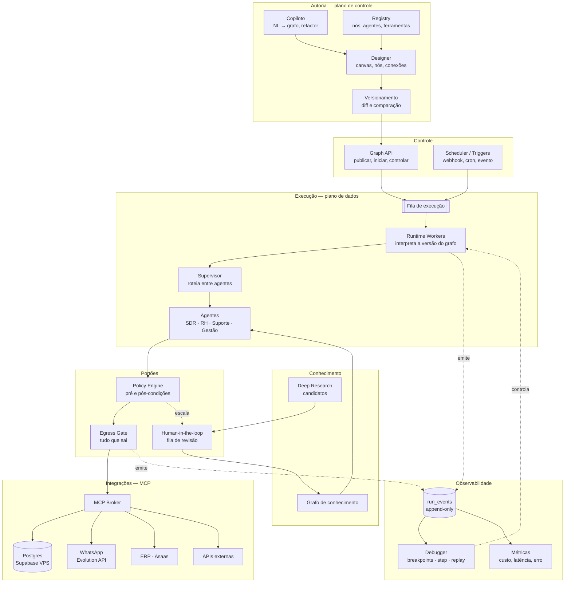
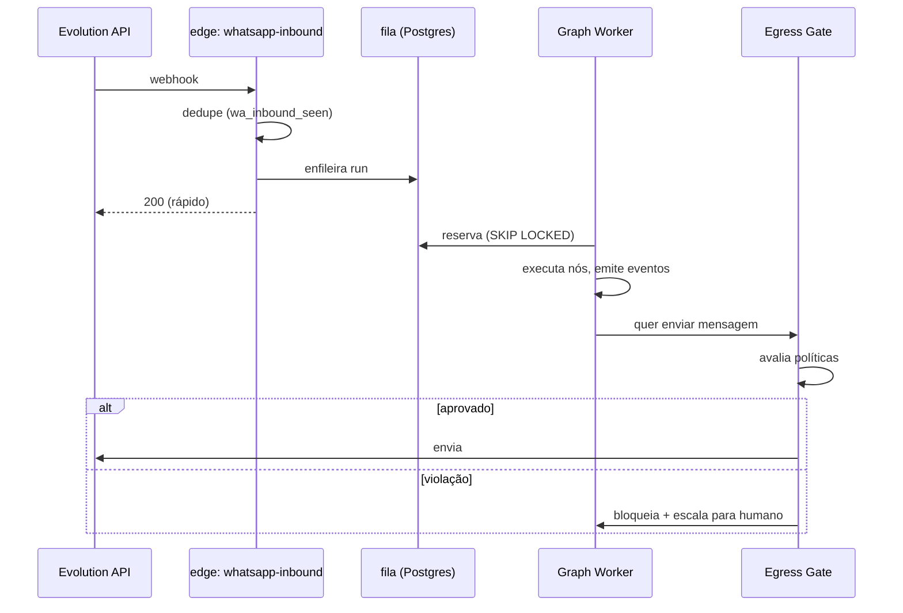
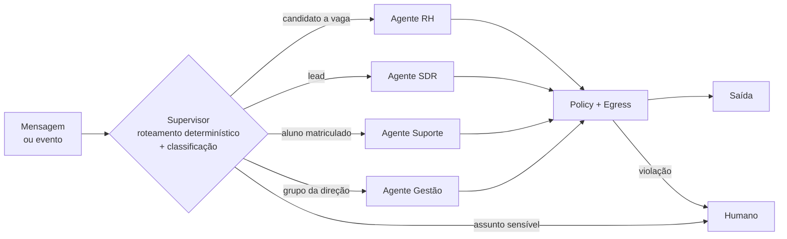
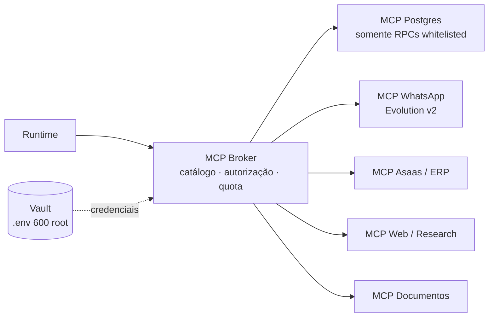
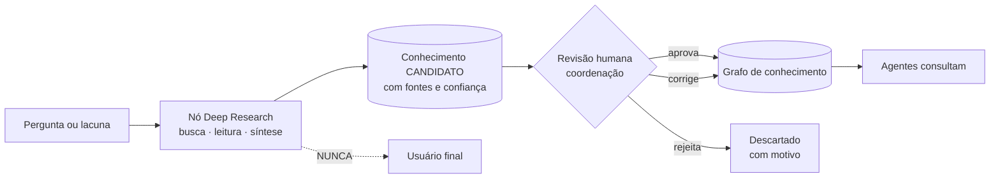

# Wise Wolf Graph Studio — arquitetura

Ambiente visual de orquestração agêntica integrado ao SaaS da Wise Wolf: editor de
grafos, execução ao vivo, depurador, múltiplos agentes com supervisor, integrações
por MCP, grafo de conhecimento, observabilidade, versionamento e copiloto.

---

## 0. Antes da arquitetura: o que de fato quebrou

Este documento nasceu de dois incidentes reais. Vale começar por eles, porque
eles definem o que a plataforma precisa impedir — e porque **um deles não seria
evitado por nenhuma quantidade de orquestração.**

### Incidente 1 — a aluna que pediu a chave PIX (07/08/2026)

```
Aluna  › "Bom dia! Por favor manda a chave pix, pedi..."
Sistema› "Identifiquei que você já é aluno(a) da Wise Wolf 😊 Vou encaminhar sua
          mensagem para a equipe responsável — não precisa preencher nada de
          matrícula novamente."
```

Nenhum LLM escreveu isso. Era uma **string fixa** em
`supabase/functions/whatsapp-inbound/index.ts:921`, enviada a qualquer aluno
contratado que mandasse mensagem. Foram **12 envios para 8 alunas**. No dia
anterior, uma aluna que escreveu *"não realizei o pagamento o mês passado, quero
pausar o contrato"* recebeu exatamente a mesma frase.

A frase existia por um bom motivo (impedir que o aluno achasse que precisava se
matricular de novo). O defeito é que ela **afirma algo sobre a situação
financeira de alguém cuja situação o código não consultou.**

> **Lição de arquitetura:** o risco não estava no modelo. Estava numa mensagem
> que saiu para fora sem ninguém revisar em que contexto ela sairia. Um grafo com
> breakpoints e replay teria mostrado o caminho — e o caminho estava correto. O
> que faltava era um **portão de saída** que recusa texto que fala de dinheiro
> sem base no estado do aluno.

### Incidente 2 — cartão cadastrado, cobrança nunca criada

**10 alunos ativos** com `asaas_customer_id` preenchido e `subscription_id`
nulo — cliente existe na Asaas, assinatura recorrente não. Total de
**R$ 2.208,05/mês** que dependem de alguém lembrar de cobrar. O pior caso pagou
pela última vez em **20/03/2026**.

Ninguém errou uma decisão aqui. **Ninguém tomou decisão nenhuma** — é um estado
intermediário que o sistema sabe representar e não sabe vigiar.

> **Lição de arquitetura:** o valor não está em executar fluxos. Está em
> **reconciliar estados que deveriam ser impossíveis** e escalar para um humano.

### O que isso implica para o escopo

| Camada | Resolve o incidente 1? | Resolve o incidente 2? |
|---|---|---|
| Editor visual de nós | não | não |
| Execução ao vivo iluminando o caminho | não | não |
| Debugger com breakpoints/replay | ajuda a diagnosticar | não |
| **Portão de egresso com política** | **sim** | não |
| **Nós de reconciliação + escalonamento** | não | **sim** |
| Observabilidade e alarme | detecta antes | **sim** |

O editor visual é a **interface** do sistema, não o valor dele. A ordem de
construção na §11 reflete isso: os portões e a reconciliação vêm antes do canvas.

---

## 1. Princípios

1. **O log de eventos é a verdade.** Todo o resto (estado atual, timeline da UI,
   métricas, replay) é projeção de um log append-only. Isso dá replay, execução
   ao vivo e comparação entre versões sem três mecanismos separados.
2. **Versão de grafo é imutável.** Executar sempre aponta para uma versão
   congelada. Sem isso, "reexecutar do nó 5" reexecuta num grafo que mudou e o
   resultado não significa nada.
3. **Nada sai do sistema sem passar por um portão.** WhatsApp, e-mail, escrita em
   ERP, cobrança: todo efeito externo atravessa a camada de egresso (§7), que é
   versionada, testável e auditável.
4. **Agente propõe, código veta.** É a regra que o repositório já aplica na
   auditoria de gabarito (`answer-key-audit.ts`) e na troca de plano do aluno.
   Aqui ela vira infraestrutura.
5. **Deep Research nunca fala com o usuário final.** Pesquisa vira conhecimento
   *candidato*; só entra na base depois de revisão humana.
6. **Tenant é isolamento, não filtro.** `tenant_id` participa de toda chave, toda
   RLS e todo evento. Escola B jamais alcança grafo, execução ou conhecimento da
   escola A.
7. **Custo é observável por nó.** Sem isso, um grafo mal desenhado vira uma conta
   de OpenRouter que ninguém sabe explicar.

---

## 2. Visão geral



**Separação essencial:** o *plano de controle* (autoria, publicação) nunca executa
nada; o *plano de dados* (runtime) nunca edita grafo. Um designer travado não
derruba conversa de aluno em andamento, e um pico de execução não trava o editor.

---

## 3. Designer (autoria)

Editor de canvas estilo n8n/LangGraph Studio. React + TypeScript, mesma stack do
SaaS. Renderização de grafo com React Flow.

**Modelo de nó** — todo nó declara um contrato, e é o contrato que permite ao
editor validar conexão antes de rodar:

```ts
interface NodeSpec {
  type: string;                 // 'agent.llm' | 'tool.mcp' | 'logic.branch' | ...
  inputSchema: JSONSchema;      // valida a aresta de entrada
  outputSchema: JSONSchema;
  sideEffects: 'none' | 'read' | 'write' | 'external';  // dirige o Egress Gate
  costModel?: { unit: 'token' | 'call'; estimate(input): number };
  retry?: { max: number; backoff: 'fixed' | 'exponential' };
  timeoutMs?: number;
}
```

**Famílias de nó**

| Família | Exemplos | Efeito |
|---|---|---|
| `trigger.*` | webhook, cron, evento de banco | — |
| `agent.*` | LLM com ferramentas, supervisor, classificador | none |
| `tool.mcp.*` | query, chamada de API, envio de mensagem | read/write/external |
| `logic.*` | branch, switch, map, join, loop com teto | none |
| `state.*` | ler/escrever estado da execução | none |
| `policy.*` | pré-condição, pós-condição, portão de egresso | none |
| `human.*` | aprovação, revisão, escalonamento | external |
| `knowledge.*` | busca no grafo, ingestão, deep research | read/write |
| `recon.*` | reconciliação de estado (§9) | read |

**Validação em tempo de autoria** (antes de qualquer execução): tipos entre
arestas compatíveis, ausência de ciclo sem teto de iteração, todo caminho
alcança um terminal, todo nó `external` está atrás de um `policy.egress`, todo
`agent.*` declara o que faz quando o modelo falha.

---

## 4. Versionamento e comparação

```
graphs            (id, tenant_id, slug, nome, created_at)
graph_versions    (id, graph_id, version, spec jsonb, checksum,
                   published_at, published_by, notes)   -- IMUTÁVEL
graph_deployments (graph_id, environment, version_id, activated_at)
```

- Publicar = congelar `spec` + checksum. Nunca se edita uma versão publicada.
- `runs.graph_version_id` é obrigatório: toda execução sabe exatamente qual
  grafo rodou.
- **Comparação entre versões** opera em dois níveis: *estrutural* (diff de nós e
  arestas, renderizado no canvas com adicionado/removido/alterado) e
  *comportamental* (mesmo conjunto de entradas replayado nas versões A e B, com
  diff de saída, custo, latência e violações de política).
- Ambientes: `draft` → `staging` → `production`, com promoção explícita. Combina
  com o `release.sh`, que já é o único caminho para a VPS.

---

## 5. Runtime

### Onde roda

**Não em edge function.** As edge functions do Supabase são o gatilho certo
(recebem webhook, respondem rápido), mas têm teto de tempo e não sobrevivem a um
fluxo que espera aprovação humana por três horas.

O runtime é um **worker container na VPS** — o padrão já existe ali
(`forza-worker`), então não é infraestrutura nova a inventar. A edge function
recebe o evento, valida, enfileira e devolve `200`. O worker consome.



Fila em Postgres com `FOR UPDATE SKIP LOCKED` — sem broker novo. O volume da
Wise Wolf não justifica Kafka, e a stack já é Postgres.

### Estado e execução

```
runs           (id, tenant_id, graph_version_id, trigger, status,
                state jsonb, started_at, finished_at, cost_cents)
run_events     (id bigserial, run_id, seq, ts, type, node_id,
                payload jsonb)                          -- APPEND-ONLY
node_executions(run_id, node_id, attempt, status, input jsonb,
                output jsonb, ms, cost_cents, error)    -- projeção
```

Tipos de evento: `run.started`, `node.entered`, `node.output`, `node.failed`,
`node.retried`, `edge.taken`, `state.patched`, `policy.evaluated`,
`egress.attempted`, `egress.blocked`, `human.requested`, `human.resolved`,
`run.finished`.

**Todo o resto sai daqui.** A iluminação ao vivo do caminho é `edge.taken`
transmitido; a timeline do debugger é a lista de eventos; o custo por nó é a
soma de `node.output.cost`; o replay é reexecutar o log. Um mecanismo, não quatro.

**Idempotência:** cada nó tem chave `(run_id, node_id, attempt)`. Nó com efeito
externo grava a intenção **antes** de executar e o resultado depois — worker que
morre no meio não duplica cobrança nem mensagem. É a mesma disciplina do
`automation_sent` que já existe no projeto.

---

## 6. Debugger

Controle via canal de controle por execução (`run_control`), lido pelo worker
entre nós.

| Recurso | Mecanismo |
|---|---|
| Breakpoint | `breakpoints(graph_version_id, node_id, condition?)`; worker pausa em `node.entered` e emite `run.paused` |
| Step over | libera exatamente um nó |
| Step into | em nó de subgrafo/agente, executa o filho passo a passo |
| Inspeção | estado, entrada e saída de cada nó vêm de `node_executions` |
| Replay | reexecuta a mesma versão com as mesmas entradas; chamadas externas em modo **gravado** por padrão |
| Reexecutar a partir do nó N | reconstrói o estado pelos eventos até N, bifurca em `runs.parent_run_id` |
| Time travel | qualquer ponto do log reconstrói o estado (é derivado, não guardado) |

⚠️ **Replay é gravado por padrão, e isso não é detalhe.** Replay que reenvia
WhatsApp de verdade transforma depuração em mensagem duplicada para aluno. Sair
do modo gravado exige confirmação explícita e fica registrado no log.

---

## 7. Políticas e portão de egresso — a camada que faltava

O ponto onde o incidente 1 morre.

```ts
interface Policy {
  id: string;
  scope: 'node' | 'egress' | 'graph';
  when: 'pre' | 'post';
  severity: 'block' | 'warn' | 'escalate';
  evaluate(ctx: PolicyContext): PolicyVerdict;
}
```

**Políticas de egresso que a Wise Wolf precisa hoje**, derivadas dos incidentes:

| Política | Regra | Origem |
|---|---|---|
| `no-unfounded-financial-claim` | Mensagem que afirma estado financeiro (pago, isento, não precisa pagar, matrícula quitada) só sai se a execução leu esse estado do banco nesta run. | Incidente 1 |
| `no-price-invention` | Valor em R$ só sai se veio de `student_pricing_plans`, `profiles.monthly_fee` ou `teacher_closings`. | Já era regra em prompt no `handleSDR` — vira código |
| `no-scheduling-promise` | Não afirmar aula "confirmada" sem `bookings` correspondente. | Já era regra em prompt |
| `tenant-match` | Destinatário pertence ao tenant da execução. | Isolamento |
| `human-required-topics` | Cancelamento, reembolso, pausa de contrato e reclamação vão para humano, não para agente. | Incidente 1 (aluna pedindo pausa) |
| `rate-and-cost-ceiling` | Teto por conversa e por hora. | Já existe como `rateLimited` — vira política |

Duas propriedades que fazem a diferença: as regras **saem do prompt e viram
código testável** (prompt é pedido, política é garantia), e toda avaliação vira
`policy.evaluated` no log — dá para medir quantas vezes o agente *tentou* dizer
algo proibido, que é o indicador que hoje não existe.

**Modos:** `shadow` (só registra — para medir antes de bloquear), `enforce`
(bloqueia) e `escalate` (bloqueia e abre item para humano). Política nova entra
em `shadow`, mede-se uma semana, promove-se.

---

## 8. Camada de agentes e supervisor



**O supervisor decide por regra antes de decidir por modelo.** O roteamento atual
do `whatsapp-inbound` já é assim (candidato → aluno → lead, nessa ordem, por
consulta ao banco) e está certo: identidade é fato, não interpretação. O modelo
só entra para classificar **assunto**, e a classificação nunca pode aumentar
privilégio — só pode escalar para humano.

**Contrato de agente:**

```ts
interface AgentSpec {
  id: string;
  systemPrompt: string;          // versionado junto com o grafo
  tools: ToolRef[];              // subconjunto explícito do MCP
  outputSchema: JSONSchema;      // saída estruturada obrigatória
  maxSteps: number;              // teto de loop
  budgetCents: number;           // teto de custo por execução
  policies: string[];            // políticas obrigatórias
  fallback: 'human' | 'template' | 'silence';
}
```

⚠️ **`fallback: 'silence'` é uma escolha legítima e muitas vezes a certa.** O
sistema hoje ignora em silêncio mensagem de grupo não autorizado, de propósito —
responder confirmaria que existe um assistente ali. Silêncio é resposta.

---

## 9. Nós de reconciliação

O ponto onde o incidente 2 morre. Um `recon.*` compara duas fontes que deveriam
concordar e abre uma pendência quando não concordam.

```ts
interface ReconSpec {
  left:  QuerySpec;    // ex.: alunos ativos com asaas_customer_id
  right: QuerySpec;    // ex.: assinaturas ativas na Asaas
  key:   string[];
  expect: 'one-to-one' | 'left-subset-of-right' | 'no-orphans';
  onMismatch: 'open_task' | 'notify' | 'auto_fix';   // auto_fix exige política
}
```

Reconciliações que o sistema precisa **agora**, todas derivadas de coisas que já
aconteceram neste repositório:

| Reconciliação | Estado impossível que ela pega |
|---|---|
| Asaas | cliente sem assinatura recorrente (**10 hoje, R$ 2.208,05/mês**) |
| Aula × pagamento | `class_logs` pagável sem `teacher_closings` correspondente |
| Presença | confirmação em `CONFLICT` parada há mais de N dias |
| Aditivo de plano | `billing_sync_status = 'FAILED'` sem ninguém avisado |
| Cobertura de aula | duas pessoas pagas pela mesma hora |
| Nota fiscal | fechamento pago há mais de 30 dias sem NF anexada |

⚠️ **`auto_fix` é a exceção, não o padrão.** Criar cobrança sozinho é decisão
comercial. O padrão é abrir pendência para o diretor, na Central de Pendências
que já existe.

---

## 10. Integrações via MCP



**Regras do broker:**

- **Nenhuma credencial alcança um agente.** O broker injeta; o modelo vê nome de
  ferramenta e argumentos. É a mesma disciplina de `OPENAI_API_KEY` viver só em
  `/opt/wisewolf/supabase-docker/.env`.
- **Sem SQL livre.** O MCP de banco expõe **RPCs nomeadas** (`gestao_snapshot`,
  `dre_gerencial`, `balancete_professores`), nunca `execute_sql`. Uma IA que
  monta a própria query decide sozinha o que é "receita" — exatamente o que este
  projeto passou semanas consertando. A definição de receita mora em uma RPC, e
  em uma só.
- **Toda chamada é escopada por tenant no servidor**, nunca por argumento vindo
  do modelo.
- Quota e custo por ferramenta, por execução e por tenant.

---

## 11. Grafo de conhecimento e Deep Research



```
knowledge_nodes  (id, tenant_id, tipo, titulo, conteudo, embedding,
                  status: candidate|approved|retired, confidence)
knowledge_edges  (from_id, to_id, relacao, peso)
knowledge_sources(node_id, url, trecho, coletado_em)
research_tasks   (id, pergunta, status, run_id, revisor, decidido_em, motivo)
```

- **A aresta pontilhada é a regra mais importante do módulo.** Pesquisa produz
  candidato, nunca resposta. O caminho `DR → USER` não existe no runtime — não é
  convenção, é ausência de aresta possível no schema de tipos.
- Todo nó aprovado guarda **procedência**: quem aprovou, quando, com que fonte.
  Conhecimento sem procedência é boato com embedding.
- Recuperação: busca vetorial (`pgvector`, já em uso no Wolfie RAG) + travessia
  de arestas, restrita a `status = 'approved'`.
- Conhecimento **expira**: preço, política e horário mudam. `retired` some da
  recuperação sem apagar o histórico.

---

## 12. Observabilidade

**Métricas por execução, nó, versão e tenant:** latência (p50/p95), custo em
centavos, taxa de erro e de retry, caminhos percorridos (quais arestas nunca
são tomadas — nó morto é grafo mentindo sobre o que faz), violações de política
por regra, taxa de escalonamento para humano.

**Alarmes que existem por causa dos incidentes:**

- `egress.blocked` acima do normal → agente tentando dizer o que não pode.
- Reconciliação com pendências crescendo → estado impossível se acumulando.
- Custo por execução acima da mediana da versão → grafo em loop.
- Fila de revisão humana parada → escalonamento virou buraco negro.

Integra com o que já existe: `ai_usage_events` e o `AiCostPanel` já separam
custo por superfície; o Graph Studio vira mais uma dimensão, não um painel
paralelo.

---

## 13. Copiloto

Gera e refatora grafos a partir de descrição em linguagem natural.

**Ele emite a especificação do grafo, e a especificação passa pelo mesmo
validador do designer.** Copiloto que escreve direto no runtime é um agente sem
portão — exatamente o que esta arquitetura existe para impedir.

Capacidades: gerar rascunho a partir de descrição; explicar um grafo existente
em português; **refatorar** (extrair subgrafo, inserir portão faltante, converter
sequência em paralelo); e **criticar** — "este nó `external` não tem
`policy.egress`", "este loop não tem teto", "este agente não declara fallback".

A crítica é onde o copiloto paga o próprio custo: ela é a revisão que os dois
incidentes não tiveram.

---

## 14. Modelo de dados (resumo)

```
-- autoria
graphs, graph_versions, graph_deployments, node_registry, agent_specs

-- execução
runs, run_events, node_executions, run_queue, run_control, breakpoints

-- portões
policies, policy_evaluations, egress_log, human_tasks

-- integrações
mcp_servers, mcp_tools, mcp_call_log

-- conhecimento
knowledge_nodes, knowledge_edges, knowledge_sources, research_tasks

-- reconciliação
recon_specs, recon_findings
```

Toda tabela leva `tenant_id`, RLS habilitada, escrita por RPC `SECURITY DEFINER`.
Policies permissivas se somam com **OR** — uma política `FOR ALL` com `USING` só
de tenant anula todas as outras. Essa pedra já custou uma correção neste
repositório (`20260804180000`, `20260804210000`); não repetir.

---

## 15. Ordem de construção

Ordenada por dano evitado, não por vistosidade.

| Fase | Entrega | Por quê primeiro |
|---|---|---|
| **1** | Egress Gate + as 6 políticas da §7, em modo `shadow`, na frente do `whatsapp-inbound` atual | Mata a classe do incidente 1 **sem** grafo nenhum. Mede antes de bloquear. |
| **2** | `run_events` + timeline de leitura das automações que já existem | Observabilidade retroativa: dá para ver o que os agentes atuais fazem. |
| **3** | Nós `recon.*` + as 6 reconciliações, abrindo pendência na Central existente | Mata o incidente 2 e os cinco primos dele. |
| **4** | Runtime worker + fila + modelo de grafo; migrar **um** fluxo (SDR) | Primeiro grafo de verdade, num fluxo com dano contido. |
| **5** | Designer (canvas, validação, publicação) + versionamento | Agora há o que desenhar e o que versionar. |
| **6** | Debugger (breakpoints, step, replay gravado) | Depende do log da fase 2 e do runtime da fase 4. |
| **7** | MCP Broker + supervisor multiagente | Amplia alcance depois que os portões existem. |
| **8** | Conhecimento + Deep Research com revisão | Maior superfície de risco: entra por último, atrás de tudo. |
| **9** | Copiloto | Precisa do validador da fase 5 para ter onde bater. |

**As fases 1 a 3 não exigem Graph Studio nenhum** e resolvem os dois problemas que
motivaram este documento. São dias de trabalho, não meses. As fases 4 a 9 são a
plataforma — valem pelo que vêm depois (agentes novos com segurança por
construção), não por consertar o que quebrou.

---

## 16. Limites honestos

- **Grafo não conserta conteúdo errado.** Se o texto que sai for ruim, um grafo
  bonito entrega texto ruim com telemetria. Portão e revisão são o que corrige.
- **Este runtime não é distribuído** e não precisa ser. Um worker com fila em
  Postgres atende a Wise Wolf com folga; propor Kafka aqui é custo sem receita.
- **Replay não é determinístico com LLM.** Modelo tem temperatura e muda do lado
  de lá. Replay reproduz o *caminho*, não a *saída* — com chamadas gravadas para
  poder comparar de verdade.
- **Deep Research é caro e lento.** Cabe em fluxo assíncrono com revisão, nunca
  no caminho de uma resposta de WhatsApp.
- **Todo humano na fila é gargalo.** Escalonamento sem alguém revisando é o
  mesmo que descartar — daí o alarme de fila parada na §12.
