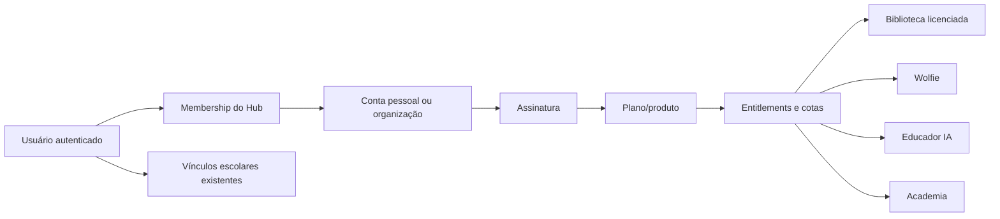

# Blueprint do Wise Wolf Marketing Hub

> Documento histórico de concepção. A arquitetura comercial vigente está em
> `docs/marketing-hub-offer-architecture-2026-08-23.md`. Em caso de conflito,
> prevalece o documento mais recente.

## 1. Resumo executivo

O Wise Wolf já possui ativos suficientes para criar um segundo produto, sem precisar construir tudo do zero. A oportunidade é transformar partes do sistema escolar em uma porta de entrada de baixo risco para três públicos:

1. pessoas que querem praticar inglês com IA;
2. professores autônomos que precisam de materiais e ferramentas de preparação;
3. escolas e instituições que precisam licenciar conteúdo para suas equipes e seus alunos.

O produto não deve ser uma versão parcialmente desbloqueada do painel escolar. Deve ser uma experiência própria, chamada provisoriamente de **Wise Wolf Hub**, com cadastro simples, teste grátis, catálogo de produtos, limites de uso e caminhos claros de conversão.

A ideia central é:

> experimentar uma ferramenta útil agora, obter um pequeno resultado real e avançar para uma assinatura — ou para o sistema escolar completo — somente quando houver valor percebido.

## 2. O que já existe e pode ser transformado em produto

### 2.1 Biblioteca pedagógica

Já existe uma base funcional de biblioteca com:

- organização por nicho, nível CEFR, coleção/livro e partes;
- materiais PDF, vídeo, áudio e link;
- busca e filtros;
- escopos global, tenant e privado;
- upload por professor e aprovação por diretor;
- atribuição de materiais a alunos;
- nichos customizados por escola.

É o ativo mais rápido para monetizar, desde que seja separado em dois acervos:

- **Acervo licenciado Wise Wolf:** conteúdo central que pode ser oferecido comercialmente;
- **Acervo privado da escola/professor:** conteúdo que continua pertencendo ao tenant e nunca entra automaticamente no catálogo comercial.

### 2.2 Wolfie Tutor e práticas com IA

O ecossistema atual já oferece:

- conversação guiada;
- vocabulário, gramática, listening, reading e writing;
- cenários profissionais e reuniões globais;
- texto e voz;
- níveis A1 a C2;
- correção, feedback, repetição obrigatória e pontuação;
- histórico, repertório e memória do aprendiz;
- proteção contra repetição de chamadas e limites técnicos por período.

É o ativo com maior capacidade de gerar desejo e recorrência, mas hoje está ligado ao perfil `STUDENT`, à escola e à verificação financeira do aluno. Para o Hub, o motor deve ganhar uma autorização por **produto/assinatura**, não por matrícula.

### 2.3 Planner de aula com IA

O Planner atual combina perfil do aluno, dificuldades do Wolfie, histórico de aulas, planos anteriores e materiais aprovados. Para um professor autônomo sem alunos cadastrados no sistema, deve existir uma versão leve:

- criação de perfis de aprendizes do próprio professor;
- geração de plano por objetivo, nível, duração e nicho;
- recomendação somente de materiais licenciados;
- histórico e duplicação de planos;
- exportação com marca Wise Wolf no teste e marca própria nos planos pagos.

### 2.4 Gerador de atividades e trilhas

O backend de conteúdo pedagógico já pode produzir JSON estruturado com IA e suporta diferentes papéis autenticados. Esse motor pode virar:

- criador de worksheet;
- gerador de quiz;
- atividade de vocabulário;
- roteiro de conversação;
- trilha curta por objetivo;
- adaptação de atividade por nível CEFR.

### 2.5 Treinamentos

O sistema possui módulos de treinamento por papel e acompanhamento de progresso. Pode virar uma futura **Academia Wise Wolf para Professores**, com minicursos gratuitos como captura e certificações como produto adicional.

### 2.6 Diagnóstico de inglês

As avaliações, quizzes, análise de fala e relatórios existentes permitem criar o melhor lead magnet do ecossistema:

- teste de nível gratuito;
- resultado imediato;
- pontos fortes e prioridades;
- recomendação de prática no Wolfie;
- convite para aula experimental ou plano de assinatura.

Esse diagnóstico deve vir antes do Wolfie no funil do público aprendiz, porque entrega um motivo personalizado para continuar.

## 3. Públicos e jornadas

Não devemos usar a mesma promessa comercial para todos.

### Jornada A — Aprendiz independente

1. Chega por anúncio, indicação ou conteúdo.
2. Faz diagnóstico rápido.
3. Recebe nível e prioridade de estudo.
4. Testa três práticas no Wolfie.
5. Assina o Wolfie ou solicita uma aula experimental.
6. Se virar aluno, mantém o histórico já criado no Hub.

### Jornada B — Professor autônomo

1. Entra por uma amostra de material ou gerador gratuito.
2. Cria uma conta profissional.
3. Visualiza amostras do acervo e gera um plano.
4. Testa o uso com um perfil de aprendiz demonstrativo.
5. Assina Biblioteca ou Educador Pro.
6. Quando crescer, recebe oferta do sistema escolar completo.

### Jornada C — Escola/instituição

1. Entra por demonstração do acervo institucional.
2. Cria uma organização e convida até dois colaboradores no trial.
3. Testa biblioteca, planner e conteúdo.
4. Escolhe licença por equipe/alunos.
5. Recebe oferta de upgrade para o SaaS escolar completo.

## 4. Produtos propostos

### Produto 1 — Biblioteca Wise Wolf

Licença mensal de acesso ao acervo, com catálogo por nível e nicho.

Regras essenciais:

- acesso condicionado a assinatura ativa;
- arquivos protegidos por links temporários;
- amostras grátis separadas do arquivo integral;
- marca d'água opcional por assinante;
- licença individual, por equipe ou institucional;
- termos claros proibindo revenda e redistribuição;
- registro de abertura/download para inteligência comercial e proteção do acervo.

### Produto 2 — Wolfie Personal

Prática de inglês por IA para não alunos, com histórico próprio e limite mensal por plano.

### Produto 3 — Educador IA

Planner, gerador de atividades, perfis leves de aprendizes e recomendações do acervo.

### Produto 4 — Hub Completo

Biblioteca + Educador IA + Academia. O Wolfie pode ser incluído como laboratório demonstrativo para o professor, mas os usos dos alunos de uma instituição devem ser vendidos por assento ou pacote.

## 5. Oferta inicial para validar

Preços de lançamento definidos para os primeiros 60 dias ou 30 clientes pagantes. Depois desse marco, revisar conversão, uso e margem antes de qualquer reajuste.

| Plano | Público | Mensal | Anual | Inclui |
|---|---|---:|---:|---|
| Descoberta | Todos | Grátis por 7 dias | — | 5 amostras, 3 práticas Wolfie, 2 gerações de IA |
| Biblioteca Solo | Professor | R$ 59 | R$ 590 | 1 usuário, acervo licenciado e atualizações |
| Educador Pro | Professor | R$ 119 | R$ 1.190 | Biblioteca, planner e 40 gerações/mês |
| Hub Completo | Professor | R$ 169 | R$ 1.690 | Educador Pro, Academia e cotas maiores |
| Institucional | Escola | a partir de R$ 397 | a partir de R$ 3.970 | equipe, licenças e gestão de uso |
| Wolfie Personal | Aprendiz | R$ 49 | R$ 490 | prática individual com cota de voz/IA |

Decisão: lançar primeiro Biblioteca Solo e Educador Pro. O anual equivale a dez mensalidades (dois meses grátis). O objetivo do primeiro ciclo é descobrir qual benefício gera ativação e qual limite é percebido como justo.

## 6. Regra do teste grátis

O teste deve ser baseado em valor e consumo, não apenas em tempo.

- duração: 7 dias;
- sem cartão no cadastro inicial;
- confirmação de e-mail;
- um trial por pessoa, com proteção por conta e sinais de abuso;
- 5 materiais em amostra, sem acesso irrestrito aos originais;
- 3 práticas Wolfie;
- 2 gerações de planner/atividade;
- marca Wise Wolf nas exportações;
- aviso de limite antes de bloquear;
- preservação do conteúdo e histórico por um período após o fim do trial;
- oferta de assinatura contextual, relacionada ao recurso que gerou valor.

Não é recomendado usar o checkout atual do SaaS escolar para esse trial. Hoje ele cria tenant, customer e assinatura no Asaas, anuncia 14 dias, mas programa cobrança para o dia seguinte. O Hub precisa de uma jornada própria, simples e coerente com a promessa “sem cartão”.

## 7. Arquitetura de acesso recomendada

### 7.1 Identidade não é assinatura

O papel `NON_STUDENT` já é aceito pela restrição do banco, mas ainda não existe no enum do frontend nem possui navegação, autorização ou produto associado. Ele pode servir como estado inicial de cadastro, mas não deve representar sozinho todas as permissões do Hub.

Uma pessoa pode ser simultaneamente:

- assinante da biblioteca;
- professora em uma escola;
- aluna em outra escola;
- proprietária de uma organização no Hub.

Por isso, as permissões devem vir de memberships e entitlements, não de um único `role`.

### 7.2 Modelo conceitual

### 7.3 Novas estruturas sugeridas

- `hub_accounts`: conta pessoal ou organização;
- `hub_memberships`: usuários e papéis dentro da conta;
- `product_catalog`: produtos vendáveis;
- `billing_plans`: preço, ciclo e versão comercial;
- `hub_subscriptions`: trial, ativa, vencida, cancelada;
- `plan_entitlements`: recurso, limite, período e regra de acesso;
- `usage_events`: consumo imutável para auditoria;
- `usage_counters`: contador rápido por período;
- `content_catalog`: metadados do acervo comercial;
- `content_assets`: amostra, original, capa e versão;
- `content_licenses`: direito de uso por conta/plano;
- `educator_learners`: perfis leves criados por professores do Hub;
- `conversion_events`: origem, ativação, limite atingido, upgrade e conversão ao SaaS.

### 7.4 Regra de autorização

Cada operação comercial deve verificar no servidor:

1. usuário autenticado;
2. membership ativa;
3. assinatura/trial válido;
4. entitlement do recurso;
5. cota disponível;
6. propriedade do registro;
7. consumo registrado somente após operação confirmada.

Esconder uma aba no frontend não é autorização suficiente. As Edge Functions e as políticas RLS devem aplicar as mesmas regras.

## 8. Mudanças necessárias nos ativos atuais

### Biblioteca

- não expor arquivos pagos por `getPublicUrl`;
- mover originais comerciais para bucket privado;
- entregar arquivos por URL assinada de curta duração;
- separar conteúdo Wise Wolf de conteúdo de tenants;
- documentar autoria e direitos de cada material;
- criar amostras próprias, sem revelar o arquivo integral;
- evitar filtragem de segurança apenas no navegador.

### Wolfie

- trocar a exigência exclusiva de `STUDENT` por um resolvedor de contexto de uso;
- manter históricos escolares e comerciais logicamente separados;
- aplicar cotas por plano, incluindo custo maior para voz/TTS;
- preservar idempotência, limites e ownership já presentes;
- permitir conversão de histórico quando um prospect se matricular.

### Planner e gerador

- aceitar `educator_learners`, além de alunos reais autorizados;
- impedir acesso cruzado entre contas;
- recomendar somente itens cobertos pela licença ativa;
- limitar geração e exportação por plano;
- registrar custo por modelo para acompanhar margem.

### Frontend

- criar rota e shell próprios, por exemplo `/hub`;
- onboarding por intenção: “quero aprender”, “sou professor” ou “represento uma escola”;
- não carregar o sidebar escolar para o usuário do Hub;
- mostrar consumo e limite de forma transparente;
- manter upgrade dentro do contexto da ação.

## 9. MVP recomendado

### Escopo do primeiro lançamento

1. landing do Hub com duas entradas: Professor e Aprendiz;
2. cadastro/login do Hub;
3. conta pessoal com trial de 7 dias;
4. catálogo com amostras e 20–30 materiais licenciáveis;
5. biblioteca paga com arquivos privados;
6. versão leve do Planner IA;
7. três práticas demonstrativas do Wolfie;
8. tela de consumo e upgrade;
9. checkout recorrente próprio do Hub;
10. painel interno de leads, trials, ativação e conversão.

### O que deixar para depois

- marketplace de materiais de terceiros;
- repasse financeiro a autores;
- sublicenciamento amplo para milhares de alunos;
- white label do Hub;
- aplicativo móvel separado;
- comunidade social;
- certificados avançados;
- múltiplos gateways de pagamento.

## 10. Roadmap sugerido

### Fase 0 — Preparação comercial e jurídica

- auditar autoria e licença dos materiais atuais;
- selecionar 20–30 itens para o acervo inicial;
- definir o que pode ser visualizado, baixado, impresso e compartilhado;
- entrevistar 5 professores autônomos e 3 escolas;
- validar nomes, promessa e faixa de preço.

### Fase 1 — Fundação do Hub

- identidade, contas, memberships e entitlements;
- trial e contadores de uso;
- shell `/hub`;
- eventos de funil;
- isolamento RLS e testes de acesso.

### Fase 2 — Biblioteca comercial

- catálogo central;
- armazenamento privado e URLs assinadas;
- amostras e licenças;
- assinatura Biblioteca Solo;
- painel de consumo.

### Fase 3 — Educador IA

- perfis leves de aprendizes;
- planner adaptado;
- gerador de atividades;
- cota mensal e exportação.

### Fase 4 — Wolfie e conversão

- contexto não escolar;
- trial controlado;
- assinatura individual;
- diagnóstico gratuito;
- ponte para aula experimental e matrícula.

### Fase 5 — Instituições

- organizações e assentos;
- administradores e relatórios;
- licenças institucionais;
- upgrade assistido para o SaaS completo.

## 11. Métricas para decidir se a ideia funciona

### Aquisição

- visitante → cadastro;
- origem do lead;
- custo por cadastro e por trial ativado.

### Ativação

- professor: abriu uma amostra + gerou um plano;
- aprendiz: terminou diagnóstico + concluiu uma prática;
- instituição: convidou um membro + abriu conteúdo.

### Conversão

- trial → assinatura;
- limite atingido → upgrade;
- Hub → demonstração do SaaS escolar;
- Hub → aula experimental/matrícula.

### Retenção e margem

- assinantes ativos em 30/60/90 dias;
- materiais abertos por assinante;
- gerações e minutos de voz por plano;
- custo de IA por receita;
- cancelamento e motivo;
- conteúdo com maior influência na conversão.

## 12. Riscos que precisam ser tratados antes da venda

1. **Direitos autorais:** nenhum material entra no acervo comercial sem autoria/licença documentada.
2. **Links públicos:** PDFs pagos não podem permanecer acessíveis por URL pública permanente.
3. **Mistura de tenants:** conteúdo e dados de uma escola nunca podem aparecer no Hub de outra conta.
4. **Custo de IA:** voz e geração precisam de cota e telemetria por operação.
5. **Abuso de trial:** limitar sem coletar dados excessivos e sem criar fricção desnecessária.
6. **Papel único:** não usar `role` como única fonte de autorização para pessoas com mais de um vínculo.
7. **Promessa comercial:** separar claramente “teste grátis do Hub” de “aula experimental” e de “trial do SaaS escolar”.
8. **LGPD:** consentimento, finalidade, retenção e exclusão para leads e perfis de aprendizes.

## 13. Decisão recomendada para o próximo ciclo

Construir primeiro o **MVP Professor**, porque ele combina o ativo mais pronto (biblioteca) com o recurso de maior valor percebido (Planner IA), tem custo de IA controlável e cria uma ponte natural para vender o sistema completo a quem crescer.

O primeiro experimento pode ser:

> Biblioteca Wise Wolf + 2 planos de aula por IA grátis durante 7 dias.

Critério de avanço: pelo menos 30 professores entram no trial, 40% chegam ao momento de ativação e 10% aceitam pagar dentro da faixa proposta. Em paralelo, o diagnóstico + Wolfie pode ser prototipado como funil do público aprendiz, sem atrasar o primeiro lançamento pago.
