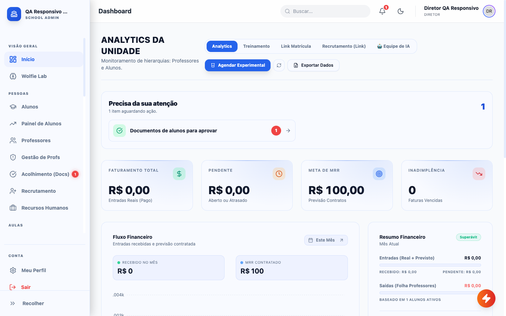
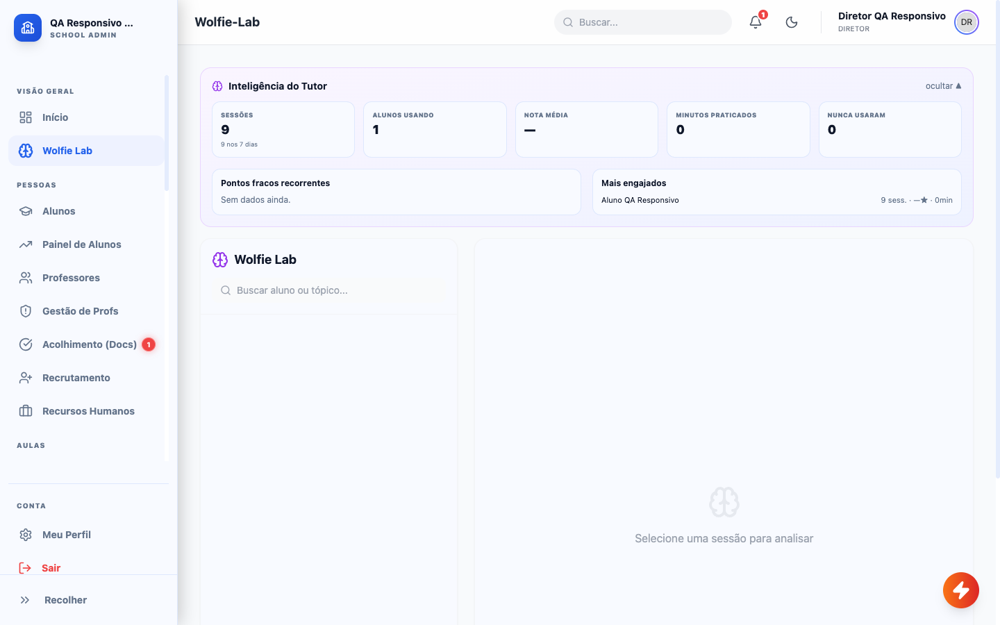
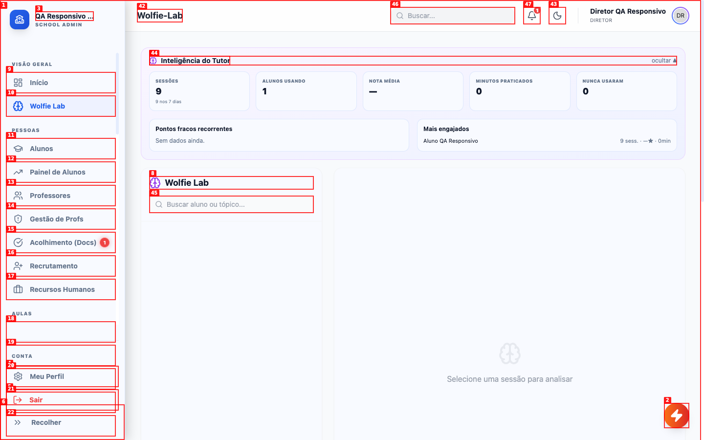
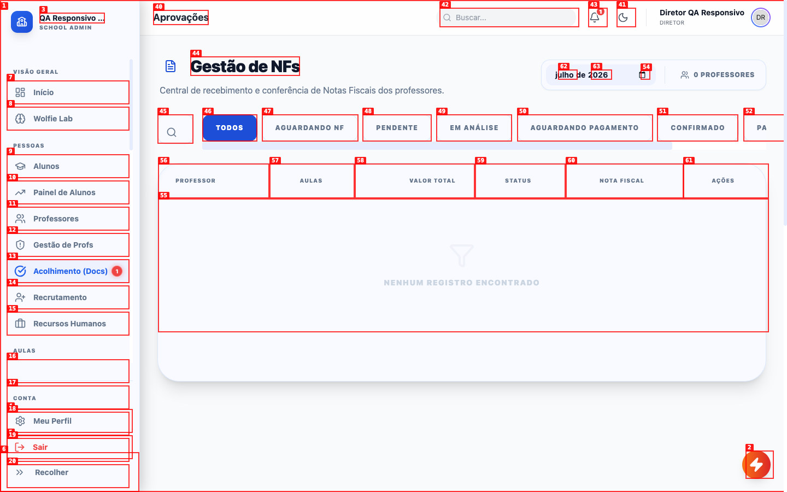
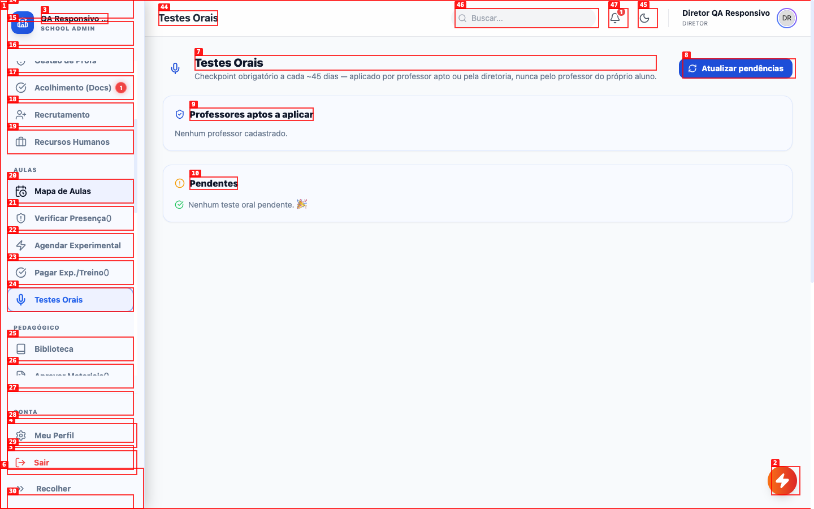
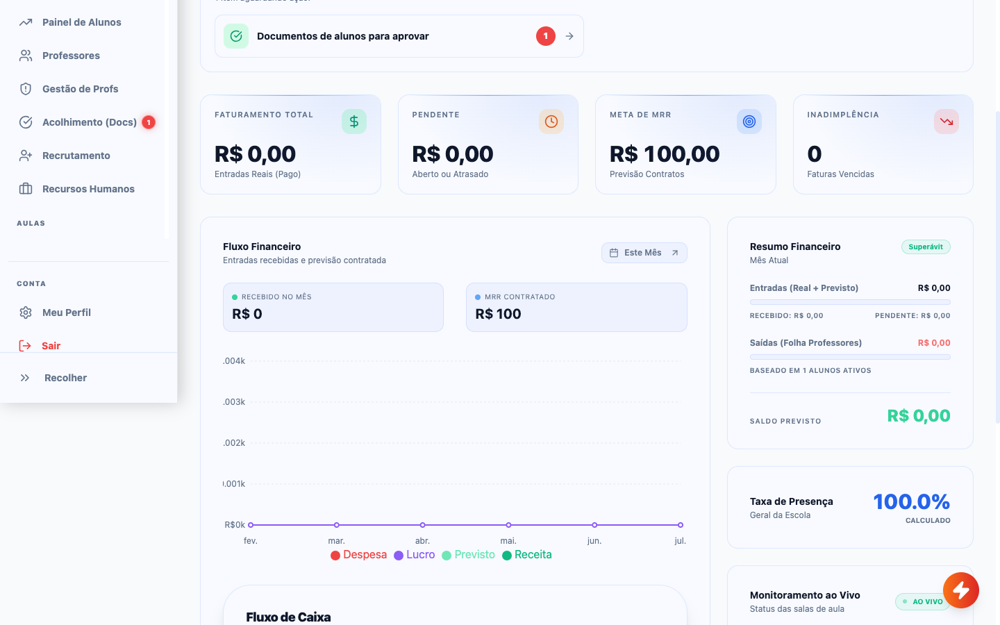
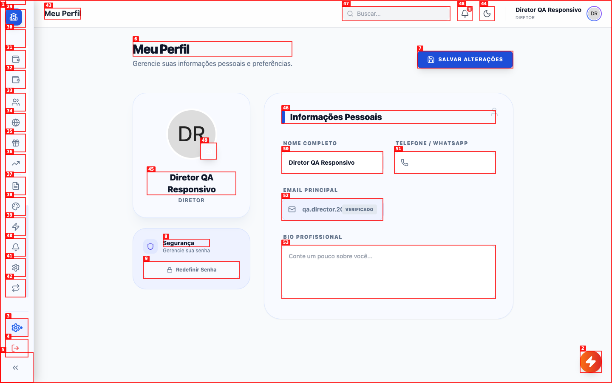
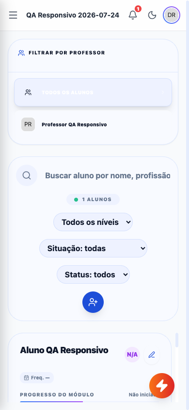
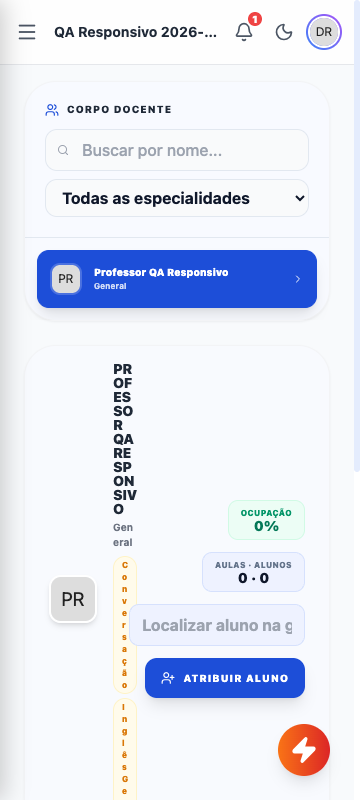

# Auditoria exploratória — Diretor

Data: 2026-07-24
Ambiente: produção
Escopo: todas as áreas acessíveis ao perfil `SCHOOL_ADMIN`, em desktop e mobile.

## Resumo

| Prioridade | Quantidade |
|---|---:|
| Crítica | 0 |
| Alta | 7 |
| Média | 2 |
| Baixa | 0 |
| **Total** | **9** |

## Cobertura

Foram cobertas as 34 telas disponíveis, em desktop 1440×900 e iPhone 12
390×844. Houve ainda spot-check em 360×800 nas áreas Início, Alunos,
Professores, Acolhimento e Mapa de Aulas. Nenhuma operação de criação, edição,
exclusão, download ou envio de comunicação foi executada.

| Área | Desktop 1440×900 | Mobile iPhone 12 | Console/rede |
|---|---|---|---|
| Início e Wolfie Lab | Cobertas | Cobertas | Wolfie: HTTP 400 |
| Alunos e Painel de Alunos | Cobertas | Cobertas | Corte vertical em Alunos |
| Professores e Gestão de Profs | Cobertas | Cobertas | Tabela comprimida no mobile |
| Acolhimento, Recrutamento e RH | Cobertas | Cobertas | Acolhimento abre destino incompatível |
| Mapa, Presença e Experimentais | Cobertas | Cobertas | Mapa inviável no mobile |
| Testes Orais | Coberta | Coberta | HTTP 403 |
| Biblioteca, Aprovações, Trilhas e Skills | Cobertas | Cobertas | Sem nova falha de carregamento |
| Treinamentos | Coberta | Coberta | Sem nova falha além da já registrada nos outros perfis |
| Mensalidades, Repasse, Fluxo e Lançamentos | Cobertas | Cobertas | Composição densa no mobile |
| CRM, Site, Indicações e Vendedores | Cobertas | Cobertas | Ações comprimidas no mobile |
| Contratos e Branding | Cobertas | Cobertas | Tabela de contratos exige rolagem interna |
| WhatsApp e Disparos | Cobertas | Cobertas | Nenhum disparo executado |
| Configuração e Workflows | Cobertas | Cobertas | Abas comprimidas no mobile |
| Meu Perfil | Coberta | Coberta | Sem falha de carregamento |

## Achados

### ISSUE-001 — Wolfie Lab mostra métricas, mas não carrega a lista de sessões

| Campo | Valor |
|---|---|
| **Prioridade** | Alta |
| **Categoria** | Funcional / rede |
| **Tela** | Wolfie Lab |
| **Ambiente** | Desktop 1440×900 |
| **Vídeo** | [Reprodução](videos/issue-001-repro-3.webm) |

**Descrição**

Ao abrir o Wolfie Lab, o painel superior informa que existem 9 sessões, porém a lista lateral permanece vazia. A requisição de sessões retorna HTTP 400 porque a API não encontra a relação solicitada entre `wolfie_sessions` e `student_id` no cache do schema. O erro foi reproduzido em duas navegações consecutivas.

**Passos para reproduzir**

1. Estar autenticado como Diretor na tela Início.
   

2. Abrir **Wolfie Lab** pelo menu lateral.
   

3. Observar que o resumo exibe 9 sessões, enquanto a lista fica vazia e nenhuma mensagem de erro ou orientação é apresentada.
   

**Evidência técnica observável**

- `GET /rest/v1/wolfie_sessions?...student:student_id(...)` → HTTP 400.
- A interface falha silenciosamente: não há alerta, tentativa de recuperação nem estado de erro para o Diretor.

**Esperado**

A lista deveria apresentar as sessões correspondentes às métricas. Se o carregamento falhar, a tela deveria informar o problema e permitir tentar novamente.

---

### ISSUE-002 — “Acolhimento (Docs)” abre a gestão de notas fiscais de professores

| Campo | Valor |
|---|---|
| **Prioridade** | Alta |
| **Categoria** | Funcional / navegação |
| **Tela** | Acolhimento (Docs) |
| **Ambiente** | Desktop 1440×900 |
| **Vídeo** | N/A — o destino incorreto é visível ao carregar |

**Descrição**

O item lateral **Acolhimento (Docs)** exibe um indicador de 1 pendência, coerente com o aviso de documento de aluno mostrado no Início. Entretanto, ao selecioná-lo, o Diretor é levado para **Aprovações › Gestão de NFs**, uma central de notas fiscais de professores. Não há acesso visível à pendência de documentação do aluno nessa tela.

**Passos para reproduzir**

1. Selecionar **Acolhimento (Docs)** no menu lateral.
2. Observar que o item fica ativo, mas o conteúdo carregado é **Gestão de NFs — Central de recebimento e conferência de Notas Fiscais dos professores**.
   

**Esperado**

O menu deveria abrir a fila de documentos e acolhimento de alunos, especialmente a pendência sinalizada pelo contador. Se a gestão de NFs também fizer parte de Aprovações, ela precisa ter entrada e rótulo próprios.

---

### ISSUE-003 — Diretor não consegue carregar os professores aptos nos Testes Orais

| Campo | Valor |
|---|---|
| **Prioridade** | Alta |
| **Categoria** | Funcional / autorização / rede |
| **Tela** | Testes Orais |
| **Ambiente** | Desktop 1440×900 |
| **Vídeo** | N/A — a falha ocorre no carregamento |

**Descrição**

Ao abrir **Testes Orais**, a consulta dos professores aptos retorna HTTP 403. A seção correspondente fica vazia, embora exista um professor ativo na unidade, e a interface não informa que o carregamento falhou.

**Passos para reproduzir**

1. Abrir **Testes Orais** pelo menu.
2. Observar as seções vazias **Professores aptos a aplicar** e **Pendentes**, sem alerta de erro.
   

**Evidência técnica observável**

- `GET /rest/v1/profiles?...role=eq.TEACHER...` → HTTP 403.

**Esperado**

O Diretor deve conseguir consultar os professores da própria unidade. Se houver uma restrição intencional, a tela precisa explicar a permissão necessária, em vez de apresentar um vazio silencioso.

---

### ISSUE-004 — Rodapé fixo oculta a maior parte do menu e desvia cliques para outras ações

| Campo | Valor |
|---|---|
| **Prioridade** | Alta |
| **Categoria** | Navegação / responsividade |
| **Tela** | Menu lateral |
| **Ambiente** | Desktop 1440×900 |
| **Vídeo** | N/A |

**Descrição**

O menu do Diretor contém 33 áreas, mas o bloco fixo **Meu Perfil / Sair / Recolher** ocupa a parte inferior da barra e deixa categorias como **Aulas**, **Pedagógico**, **Financeiro**, **Comercial** e **Configurações** fora da região clicável. A roda do mouse sobre a área vazia passa a rolar o conteúdo principal, não revela os itens. Um clique físico direcionado a um item oculto pode atingir o rodapé sobreposto, abrindo **Meu Perfil** ou encerrando a sessão. A cobertura só pôde continuar usando foco de teclado nos elementos invisíveis.

**Passos para reproduzir**

1. Abrir o sistema em 1440×900.
2. Rolar a barra lateral para baixo até **Aulas**.
3. Observar que o título da categoria aparece sem os itens, enquanto o rodapé fixo permanece por cima da região destinada à navegação.
   

**Esperado**

Todo o conteúdo do menu deve rolar em uma área própria até ficar completamente visível, enquanto o rodapé permanece fora dessa área ou reduz sua altura sem sobrepor itens. Nenhum clique em navegação deve atingir **Sair** ou **Meu Perfil** por sobreposição.

---

### ISSUE-005 — Menu recolhido perde o nome acessível de quatro áreas

| Campo | Valor |
|---|---|
| **Prioridade** | Média |
| **Categoria** | Acessibilidade / navegação |
| **Tela** | Menu lateral recolhido |
| **Ambiente** | Desktop 1440×900 |
| **Vídeo** | N/A |

**Descrição**

Ao usar **Recolher**, o menu passa a exibir apenas ícones. A maioria dos botões preserva o nome acessível, mas quatro entradas com contador passam a ser anunciadas somente como **“1”** ou **“0”**: Acolhimento, Verificar Presença, Pagar Exp./Treino e Aprovar Materiais. Os botões de sair e expandir também ficam sem nome na árvore de acessibilidade. Isso impede que pessoas usando leitor de tela identifiquem essas ações e torna os ícones ambíguos para novos usuários.

**Passos para reproduzir**

1. Selecionar **Recolher** no rodapé do menu.
2. Navegar por teclado pelos itens com contador.
3. Observar que os nomes são substituídos apenas pelo número do contador.
   

**Esperado**

Cada botão deve manter um nome acessível completo, oferecer tooltip ao passar o mouse ou receber foco e preservar nomes como **Acolhimento (Docs) — 1 pendência**.

---

### ISSUE-006 — Cartão do aluno fica cortado e não pode ser rolado no mobile

| Campo | Valor |
|---|---|
| **Prioridade** | Alta |
| **Categoria** | Responsividade / funcional |
| **Tela** | Alunos |
| **Ambiente** | Mobile 390×844 — equivalente ao iPhone 12 |
| **Vídeo** | N/A |

**Descrição**

Na tela **Alunos**, filtros e lista são reorganizados em coluna, mas o documento fica limitado praticamente à altura da viewport (`845 px` para uma viewport de `844 px`). O cartão do aluno continua abaixo do limite e é cortado após **Progresso do módulo**. Tentar rolar 600 px mantém a página em `scrollY = 1`, portanto horário, interesses, ocupação e ações do aluno ficam inacessíveis.

**Passos para reproduzir**

1. Abrir **Alunos** em 390×844.
2. Tentar rolar depois dos filtros até o final do cartão.
3. Observar que a página não avança e o conteúdo permanece cortado.
   

**Esperado**

A tela deve crescer conforme o conteúdo e permitir rolagem vertical natural até todas as informações e ações do aluno, mantendo botões destrutivos separados e claramente identificados.

---

### ISSUE-007 — Mapa de Aulas transforma dados do professor em texto vertical

| Campo | Valor |
|---|---|
| **Prioridade** | Alta |
| **Categoria** | Responsividade / acesso à informação |
| **Tela** | Mapa de Aulas |
| **Ambiente** | Mobile 390×844 e 360×800 |
| **Vídeo** | N/A |

**Descrição**

O cartão detalhado do professor mantém a composição horizontal de desktop.
Nome, especialidade e indicadores são comprimidos em colunas de poucos
caracteres, formando texto vertical. O campo de busca do aluno também é
cortado e compete com o botão de atribuição, tornando a operação inviável no
celular.

**Evidência**

**Esperado**

No mobile, exibir os dados em blocos empilhados, preservar palavras inteiras e
colocar busca e ação em linhas próprias.

---

### ISSUE-008 — Tabelas administrativas perdem colunas, ações e legibilidade no mobile

| Campo | Valor |
|---|---|
| **Prioridade** | Alta |
| **Categoria** | Responsividade / acesso à informação |
| **Telas** | Professores e Contratos |
| **Ambiente** | Mobile 390×844 e 360×800 |
| **Vídeo** | N/A |

**Descrição**

Em **Professores**, o cabeçalho `STATUS` quebra em uma coluna vertical e as
ações ficam fora da região visível. Em **Contratos**, a tabela mantém a largura
de desktop; data, assinatura, status e ações são cortados, e a barra horizontal
é discreta e desconectada dos cabeçalhos. Em ambos os casos, a informação
necessária para administrar o registro não cabe no fluxo mobile.

**Evidências**

- [Professores](screenshots/mobile-professores.png)
- [Contratos](screenshots/mobile2-contratos.png)

**Esperado**

Usar cartões por registro no mobile ou uma tabela com rolagem interna
explicitamente indicada, primeira coluna fixa e ações sempre alcançáveis.

---

### ISSUE-009 — Ações e abas de áreas comerciais/configuração são comprimidas

| Campo | Valor |
|---|---|
| **Prioridade** | Média |
| **Categoria** | Responsividade / visual |
| **Telas** | Vendedores, Configuração e Workflows |
| **Ambiente** | Mobile 390×844 |
| **Vídeo** | N/A |

**Descrição**

O botão **Convidar vendedor** é reduzido até quebrar palavras em várias linhas.
Em Configuração, o selo de personalização quebra palavra por palavra; em
Workflows, as abas ocupam várias linhas e perdem a leitura como conjunto de
navegação. Os controles continuam presentes, mas exigem esforço desnecessário
e parecem componentes quebrados.

**Evidências**

- [Vendedores](screenshots/mobile2-vendedores.png)
- [Configuração](screenshots/mobile2-config-avancada.png)
- [Workflows](screenshots/mobile2-workflows-recheck.png)

**Esperado**

Empilhar ações e permitir que abas se tornem seletor, lista rolável horizontal
ou grid de uma coluna, sempre com largura mínima para preservar palavras.

## Ordem recomendada de correção

1. Corrigir o destino de Acolhimento e as autorizações de Wolfie Lab/Testes
   Orais.
2. Corrigir a rolagem da sidebar e impedir que o rodapé intercepte cliques.
3. Liberar a rolagem vertical de Alunos no mobile.
4. Criar variantes mobile para Mapa de Aulas e tabelas administrativas.
5. Ajustar ações/abas comprimidas e completar nomes acessíveis.
