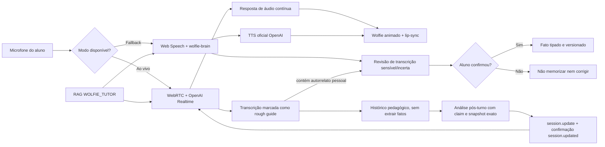

# Wolfie Tutor: voz em tempo real, memória factual e RAG

## Resultado esperado

O Wolfie oferece uma conversa contínua por voz, com interrupção natural e
movimento do mascote sincronizado ao áudio. Quando o navegador ou o provedor
Realtime não estiver disponível, a interface volta automaticamente para o modo
clássico sem perder a opção de texto.

O caso crítico “Nova Iguaçu x Bahia” é tratado por três regras:

1. a transcrição de áudio é uma hipótese, nunca uma verdade factual;
2. nomes, lugares e fatos pessoais são confirmados pelo aluno antes de poderem
   alimentar memória ou correção;
3. residência, origem e local de nascimento são fatos diferentes e nunca devem
   ser fundidos.

## Arquitetura



### Conversa ao vivo

- O navegador abre uma conexão WebRTC; a chave OpenAI permanece somente no
  servidor.
- A Edge Function `wolfie-realtime-session` cria a chamada pelo endpoint
  `/v1/realtime/calls`.
- Antes da chamada paga, `wolfie-brain` prepara uma sessão idempotente e valida
  autenticação, tenant ativo, matrícula financeira, fixture, cota e limite de
  criação. O navegador não envia a configuração pedagógica na URL do WebRTC;
  envia somente o identificador da conversa preparada.
- O padrão é `gpt-realtime-2.1`, voz masculina `cedar`, redução de ruído e VAD semântico.
- A fala pode interromper o Wolfie. Os níveis reais do microfone e da resposta
  movimentam o mascote.
- A transcrição auxiliar do áudio é salva como histórico sinalizado
  `transcriptIsRoughGuide=true`. A persistência do diálogo acontece primeiro;
  uma análise pedagógica pós-turno, idempotente e de melhor esforço, pode então
  registrar rubrica, prioridade, correção e próximo passo sem jamais transformar
  a transcrição em fato confirmado.
- Se a fala contiver um autorrelato pessoal que exige confirmação, o pós-turno
  fica `awaiting_confirmation`: não cria correção nem memória a partir do trecho
  incerto. Falha ou indisponibilidade do avaliador também não apaga nem invalida
  a transcrição já salva.
- Correções pós-turno só são aceitas quando citam literalmente um trecho do
  aluno e preservam nomes, lugares, números e significado. Estágio, retry, nível
  adaptativo e o ponto de retomada da reunião ficam no servidor para a próxima
  conexão.
- Ao terminar cada resposta, voz e texto ficam temporariamente bloqueados. O
  próximo turno só é liberado depois que o backend salva e analisa o anterior e
  a OpenAI devolve `session.updated` contendo o checkpoint validado. Falha,
  rejeição ou timeout dessa atualização preserva o turno e transfere a conversa
  para a voz clássica; o aluno nunca continua com instruções silenciosamente
  desatualizadas.
- Se o turno contiver um autorrelato pessoal, o microfone pausa após a resposta
  e o aluno confirma ou edita a transcrição. A ação separada
  `confirm_realtime_fact` só então registra o fato, validando aluno, tenant,
  sessão e turno, sem fazer uma nova chamada de IA.
- `analysisStatus = awaiting_confirmation` devolvido pelo servidor é a fonte
  autoritativa do modal. Entrada digitada não passa por confirmação de ASR; fala
  incerta continua bloqueada mesmo quando a heurística local divergir.

### Atomicidade pós-turno

- O banco rejeita a inserção de pares Realtime em sessão concluída, abandonada
  ou falha, inclusive quando encerramento e callback competem.
- Um RPC com lock concede apenas um claim de análise por turno; claims recentes
  não podem ser roubados e um claim interrompido pode expirar com segurança.
- Uma única transação fenced grava sessão, memória, relatório JSON, projeção em
  `wolfie_session_reports`, correções, conclusão de retry e o mesmo marker
  terminal nos dois turnos. Não existe janela em que a sessão termine com o
  último turno ainda em `processing` ou com o relatório materializado ausente.
- A saída do avaliador fica vinculada ao snapshot exato de report, memory,
  estágio, status e correção pendente que ele recebeu. Se outro callback mudar
  qualquer parte desse checkpoint, a gravação falha como `retryable` e uma nova
  avaliação é feita; a mesma saída nunca é “rebaseada” sobre um estado novo.
- O estágio gravado no turno do aluno é a proveniência imutável da evidência.
  Uma resposta admitida em `practice` não vira evidência autônoma só porque a
  análise terminou depois de a sessão avançar para `assessment`.
- Cada sessão elege um único protocolo de escrita no primeiro turno: clássico ou
  Realtime. O banco rejeita mistura acidental entre os dois. Se o Realtime
  falhar, a interface solicita um handoff explícito e idempotente antes do
  primeiro turno clássico, preservando o mesmo `conversationId`, checkpoint e
  relatório. O handoff só é liberado quando não há grant ao vivo aberto, lease
  Realtime de processamento ainda válido ou análise aguardando confirmação.
  Claims órfãs que ultrapassam dois minutos são encerradas atomicamente como
  indisponíveis; depois do handoff, o banco bloqueia novas escritas Realtime
  nessa sessão.

### Modo clássico

- O reconhecimento do navegador solicita até cinco alternativas.
- Baixa confiança, alternativas divergentes ou autorrelatos pessoais abrem o
  modal “Confirme o que o Wolfie ouviu”.
- O servidor também exige a confirmação explícita; não confia apenas na decisão
  da interface.
- Cada contribuição usa um UUID preservado após timeout ou perda de resposta.
  Antes de chamar novamente o modelo, o servidor procura o par já persistido e
  devolve sua resposta canônica. Aluno, Wolfie, correções, retry, sessão,
  memória e relatório são gravados por uma única transação com snapshot exato;
  concorrência obsoleta não é rebaseada.
- O TTS usa a API oficial da OpenAI. Web Speech é o último fallback local.

## Memória

### Fatos do aluno

`wolfie_facts` mantém fatos tipados, fonte, sessão, turno, versão, confiança,
estado de verificação e ciclo de vida. Há no máximo um valor ativo por
`student_id + fact_type + subject_key`.

Tipos iniciais:

- `resides_in`
- `is_from`
- `born_in`
- `preferred_name`
- `pronouns`
- `timezone`
- `language_preference`
- `learning_preference`
- `personal_preference`

Há no máximo um valor ativo por
`tenant_id + student_id + fact_type + subject_key`. Uma declaração nova
substitui apenas o mesmo tipo dentro daquele tenant. Portanto, “sou da Bahia” não
apaga “moro em Nova Iguaçu”. O aluno pode contestar uma interpretação, e o
registro antigo permanece auditável como disputado ou substituído.

### Memória pedagógica

`wolfie_memory_items` continua reservado a evidências de aprendizagem:
objetivos, pontos fortes, lacunas linguísticas, estruturas em progresso e
preferências pedagógicas não sensíveis. Atividades usam seleção fail-closed:
somente itens ativos, confiáveis, pertencentes ao aluno/tenant e relevantes à
matéria ou experiência.

Em avaliações de reunião, memória entre sessões usa apenas uma taxonomia fixa
derivada no servidor das oito dimensões da rubrica. Texto livre do transcript ou
de `strengths/priorities` do modelo não é promovido a memória, o que impede que
nomes, decisões corporativas ou instruções maliciosas persistam no próximo
treino.

O escritor `record_wolfie_meeting_memories` valida tenant ativo, sessão de
reunião, tentativa persistida, chave, conteúdo e rubrica canônicos. A mesma
tentativa não aumenta contagem; avaliações diferentes acrescentam recorrência e
mantêm no máximo vinte evidências. No Realtime, uma segunda barreira valida
tenant, aluno, origem, expiração e taxonomia, remove metadados internos e exclui
perfil livre, fatos pessoais e memórias de outros exercícios do prompt da
reunião.

### Correções e retry

`wolfie_corrections.status` possui os estados:

- `active`
- `disputed`
- `invalid`
- `superseded`

Somente uma correção ativa pode bloquear uma nova tentativa por sessão. Uma
correção contestada deixa de alimentar retry, relatório e inteligência
consolidada. A ação `dispute_correction` remove a contaminação derivada daquele
erro sem apagar a trilha de auditoria.

## RAG de conhecimento

A base reutilizável do tutor usa `purpose = 'WOLFIE_TUTOR'`. Ela é isolada da
base `WISE_WOLF_PLANNER` e nunca deve conter fatos individuais de alunos.

Exemplo de provisionamento por tenant:

```sql
insert into public.ai_knowledge_bases (
  tenant_id,
  provider,
  purpose,
  embedding_model,
  embedding_dimensions,
  version,
  status,
  retrieval_config
)
values (
  '<tenant-id>',
  'OPENROUTER',
  'WOLFIE_TUTOR',
  'openai/text-embedding-3-small',
  1536,
  1,
  'ACTIVE',
  '{"match_count": 5, "min_similarity": 0.55}'::jsonb
);
```

Os documentos e chunks seguem a infraestrutura já usada pelo Planner, sempre
associados ao `knowledge_base_id` criado acima. O navegador não escolhe tenant,
base nem filtros de busca.

## Configuração

Variáveis públicas de build:

```dotenv
VITE_WOLFIE_REALTIME_ENABLED=true
```

Segredos e configurações exclusivos do runtime das Edge Functions:

```dotenv
OPENAI_API_KEY=<segredo>
OPENAI_REALTIME_MODEL=gpt-realtime-2.1
OPENAI_REALTIME_TRANSCRIPTION_MODEL=gpt-4o-mini-transcribe
OPENAI_REALTIME_VOICE=cedar
OPENAI_SAFETY_SALT=<segredo-aleatorio>
WOLFIE_TTS_MODEL=gpt-4o-mini-tts
WOLFIE_TTS_VOICE_EN=cedar
WOLFIE_TTS_VOICE_PT=cedar
```

`OPENAI_SAFETY_SALT` é recomendado para separar os identificadores de segurança
do Realtime. Se o runtime ainda não o encaminhar ao worker, a função usa a
`SUPABASE_SERVICE_ROLE_KEY` como segredo de derivação; o fallback público existe
apenas para impedir falha de inicialização em ambientes locais incompletos.

Nenhuma chave pode usar prefixo `VITE_`, aparecer em arquivos versionados ou ser
enviada ao navegador.

## Ordem de publicação

1. Validar e aplicar, na ordem, as migrations
   `20260730193415_wolfie_factual_memory_and_rag.sql`,
   `20260731023000_harden_tenant_membership_roles.sql`,
   `20260801190000_wolfie_realtime_analysis_atomicity.sql`,
   `20260801200000_wolfie_tenant_quota_usage_hardening.sql`,
   `20260801210000_wolfie_classic_exchange_atomicity.sql`,
   `20260801220000_wolfie_meeting_memory_lifecycle.sql` e
   `20260801230000_repair_wolfie_sql_special_forms.sql` pelo pipeline
   autorizado.
2. Configurar os segredos OpenAI no runtime das funções.
3. Publicar `wolfie-brain`, `wolfie-realtime-session`, `wolfie-tts`,
   `wolfie-activity`, `create-wolfie-topup` e `asaas-webhook` como uma mesma
   release compatível com essas migrations.
4. Validar e aplicar o núcleo reutilizável por tenant com
   `node scripts/provision-wolfie-rag.mjs --validate-only` e, no ambiente
   autorizado, `node scripts/provision-wolfie-rag.mjs --apply`.
5. Publicar o frontend com `VITE_WOLFIE_REALTIME_ENABLED=true`.
6. Executar smoke tests autenticados e manter a voz clássica disponível durante
   todo o rollout.

O provisionamento é idempotente por base, origem e checksum. Ele gera embeddings
uma vez por versão do corpus e replica somente conhecimento pedagógico aprovado;
fatos individuais continuam fora da RAG.

Os scripts de release executam apenas `--validate-only`: publicar o código não
grava nem substitui documentos da RAG. O `--apply` é uma etapa operacional
separada, executada uma única vez por versão do corpus por uma pessoa
autorizada, com `SUPABASE_URL`, `SUPABASE_SERVICE_ROLE_KEY` e
`OPENROUTER_API_KEY` disponíveis somente no ambiente protegido e a partir do
checkout revisado desta versão. A aplicação só aceita os corpora versionados no
repositório; `--corpus` serve exclusivamente para validação local. A execução só
termina com sucesso depois de confirmar, para cada tenant e cada documento
esperado, base ativa, documento `READY`, chunks e uma recuperação vetorial do
próprio `document_id`. Nenhuma dessas gravações foi feita durante o
desenvolvimento desta mudança.

O script `deploy/vps/release-wolfie.sh` inclui a migration, os testes, as quatro
funções, checagem de autenticação, troca atômica e rollback isolados do restante
do produto.

## Critérios de aceite

- “I live in Nova Iguaçu” abre confirmação no modo clássico.
- “I am from Bahia” e “I live in Nova Iguaçu” coexistem em slots diferentes.
- Uma transcrição Realtime nunca gera `wolfie_facts` sozinha; autorrelatos
  sensíveis aguardam confirmação antes de qualquer uso factual ou correção.
- A análise pós-turno é idempotente por turno, usa apenas a configuração da
  sessão persistida e não impede que o histórico seja salvo quando o provedor de
  avaliação estiver indisponível.
- O aluno não consegue iniciar outro turno antes do ACK `session.updated`; se o
  ACK não chegar, o modo ao vivo fecha e o turno salvo permanece no histórico.
- Um fato dito no Realtime só é gravado depois do modal de confirmação; repetir
  a mesma confirmação é idempotente.
- “Wolfie entendeu errado” libera a sessão e invalida a correção contaminada.
- Não há mais de um retry pendente por sessão.
- Fato pessoal sem relação com a atividade não aparece no enunciado.
- Meta pedagógica confirmada e relevante pode personalizar a atividade.
- Atividades de escrita oferecem produção textual e feedback compatíveis com o
  nível e a experiência.
- Interrupção durante a resposta para o áudio do Wolfie e devolve o turno ao
  aluno.
- Falha de Realtime troca automaticamente para a voz clássica.
- O mascote respeita `prefers-reduced-motion`.

### Critérios adicionais para reunião global

- A permissão do microfone vem antes da criação da sessão; o WebRTC recebe na
  URL somente o `conversationId`, e todo o cenário é recarregado no servidor.
- Dúvida, revisão, pedido de modelo ou feedback pausam a simulação e preservam
  estágio, interlocutor, pergunta e decisão pendentes.
- Texto e voz usam a mesma rubrica de oito dimensões: tarefa, estrutura,
  interação, esclarecimento, diplomacia, clareza, precisão/naturalidade e
  fechamento acionável. Pronúncia e entonação agregam evidência de entrega, mas
  não aprovam uma fala fora do objetivo ou cenário.
- A prontidão é acumulada por dimensão em vários turnos independentes de
  `simulation`, `readaptation`, `improvisation` e `assessment`. Uma fala parcial
  não precisa fingir oito scores; o relatório final usa o agregado completo, e
  não apenas a última contribuição.
- Scores de `guided_build` e `practice` nunca entram na prontidão autônoma. O
  latch de aprovação só é ligado quando as oito dimensões e os gates centrais
  passam; um encerramento como “thanks” pode concluir o fluxo sem apagar essa
  evidência já comprovada.
- Retry abaixo de 75 e os gates mínimos de tarefa, estrutura, interação e
  fechamento acionável são determinísticos; uma nova tentativa é obrigatória
  antes de avançar.
- Micro-retry linguístico mede `accuracy_and_naturalness`; retry de competência
  mede somente a dimensão persistida como alvo. Score geral ou dimensão não
  relacionada não libera a correção.
- A memorização só libera a readaptação depois que o servidor compara a
  reconstrução independente dos seis blocos com tentativas aprovadas já
  persistidas. O texto reconstruído e o áudio bruto não são armazenados nessa
  evidência: permanecem somente digest SHA-256, scores e IDs das referências.
- Evidência de memorização validada é monotônica. Validação concorrente ou
  salvamento automático antigo usam compare-and-swap e não conseguem apagá-la.
- A readaptação muda pelo menos duas variáveis materiais e rejeita reutilização
  substancial do roteiro anterior, inclusive quando ele recebe um apêndice
  longo.
- O nível adaptativo varia no máximo uma etapa por evidência observada, e o
  relatório diferencia ajuda oferecida de desempenho independente.

## Referências oficiais

- [OpenAI Realtime](https://developers.openai.com/api/docs/guides/realtime)
- [OpenAI Realtime conversations](https://developers.openai.com/api/docs/guides/realtime-conversations)
- [OpenAI Audio e TTS](https://developers.openai.com/api/docs/guides/text-to-speech)
- [Supabase Edge Functions](https://supabase.com/docs/guides/functions)
- [Supabase pgvector](https://supabase.com/docs/guides/database/extensions/pgvector)
- [Supabase Row Level Security](https://supabase.com/docs/guides/database/postgres/row-level-security)
