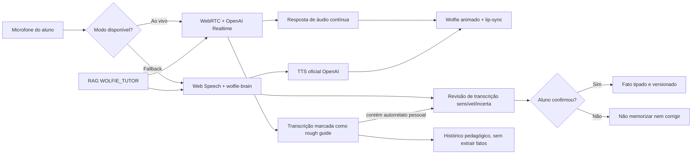

# Wolfie Tutor: voz em tempo real, memória factual e RAG

## Resultado esperado

O Wolfie oferece uma conversa contínua por voz, com interrupção natural e
movimento do mascote sincronizado ao áudio. Quando o navegador ou o provedor
Realtime não estiver disponível, a interface volta automaticamente para o modo
clássico sem perder a opção de texto.

O caso crítico “Nova Iguaçu x Bahia” é tratado por três regras:

1. a transcrição de áudio é uma hipótese, nunca uma verdade factual;
2. nomes, lugares e fatos pessoais são confirmados pelo aluno antes de poderem
   alimentar memória ou correção;
3. residência, origem e local de nascimento são fatos diferentes e nunca devem
   ser fundidos.

## Arquitetura



### Conversa ao vivo

- O navegador abre uma conexão WebRTC; a chave OpenAI permanece somente no
  servidor.
- A Edge Function `wolfie-realtime-session` cria a chamada pelo endpoint
  `/v1/realtime/calls`.
- O padrão é `gpt-realtime-2.1`, voz `marin`, redução de ruído e VAD semântico.
- A fala pode interromper o Wolfie. Os níveis reais do microfone e da resposta
  movimentam o mascote.
- A transcrição auxiliar do áudio é salva apenas como histórico sinalizado
  `transcriptIsRoughGuide=true`. Ela não cria fatos, correções, prioridades ou
  memória consolidada.
- Se o turno contiver um autorrelato pessoal, o microfone pausa após a resposta
  e o aluno confirma ou edita a transcrição. A ação separada
  `confirm_realtime_fact` só então registra o fato, validando aluno, tenant,
  sessão e turno, sem fazer uma nova chamada de IA.

### Modo clássico

- O reconhecimento do navegador solicita até cinco alternativas.
- Baixa confiança, alternativas divergentes ou autorrelatos pessoais abrem o
  modal “Confirme o que o Wolfie ouviu”.
- O servidor também exige a confirmação explícita; não confia apenas na
  decisão da interface.
- O TTS usa a API oficial da OpenAI. Web Speech é o último fallback local.

## Memória

### Fatos do aluno

`wolfie_facts` mantém fatos tipados, fonte, sessão, turno, versão, confiança,
estado de verificação e ciclo de vida. Há no máximo um valor ativo por
`student_id + fact_type + subject_key`.

Tipos iniciais:

- `resides_in`
- `is_from`
- `born_in`
- `preferred_name`
- `pronouns`
- `timezone`
- `language_preference`
- `learning_preference`
- `personal_preference`

Uma declaração nova substitui apenas o mesmo tipo. Portanto, “sou da Bahia” não
apaga “moro em Nova Iguaçu”. O aluno pode contestar uma interpretação, e o
registro antigo permanece auditável como disputado ou substituído.

### Memória pedagógica

`wolfie_memory_items` continua reservado a evidências de aprendizagem:
objetivos, pontos fortes, lacunas linguísticas, estruturas em progresso e
preferências pedagógicas não sensíveis. Atividades usam seleção fail-closed:
somente itens ativos, confiáveis, pertencentes ao aluno/tenant e relevantes à
matéria ou experiência.

### Correções e retry

`wolfie_corrections.status` possui os estados:

- `active`
- `disputed`
- `invalid`
- `superseded`

Somente uma correção ativa pode bloquear uma nova tentativa por sessão. Uma
correção contestada deixa de alimentar retry, relatório e inteligência
consolidada. A ação `dispute_correction` remove a contaminação derivada daquele
erro sem apagar a trilha de auditoria.

## RAG de conhecimento

A base reutilizável do tutor usa `purpose = 'WOLFIE_TUTOR'`. Ela é isolada da
base `WISE_WOLF_PLANNER` e nunca deve conter fatos individuais de alunos.

Exemplo de provisionamento por tenant:

```sql
insert into public.ai_knowledge_bases (
  tenant_id,
  provider,
  purpose,
  embedding_model,
  embedding_dimensions,
  version,
  status,
  retrieval_config
)
values (
  '<tenant-id>',
  'OPENROUTER',
  'WOLFIE_TUTOR',
  'openai/text-embedding-3-small',
  1536,
  1,
  'ACTIVE',
  '{"match_count": 5, "min_similarity": 0.55}'::jsonb
);
```

Os documentos e chunks seguem a infraestrutura já usada pelo Planner, sempre
associados ao `knowledge_base_id` criado acima. O navegador não escolhe tenant,
base nem filtros de busca.

## Configuração

Variáveis públicas de build:

```dotenv
VITE_WOLFIE_REALTIME_ENABLED=true
```

Segredos e configurações exclusivos do runtime das Edge Functions:

```dotenv
OPENAI_API_KEY=<segredo>
OPENAI_REALTIME_MODEL=gpt-realtime-2.1
OPENAI_REALTIME_TRANSCRIPTION_MODEL=gpt-4o-mini-transcribe
OPENAI_REALTIME_VOICE=marin
OPENAI_SAFETY_SALT=<segredo-aleatorio>
WOLFIE_TTS_MODEL=gpt-4o-mini-tts
WOLFIE_TTS_VOICE_EN=marin
WOLFIE_TTS_VOICE_PT=marin
```

`OPENAI_SAFETY_SALT` é recomendado para separar os identificadores de segurança
do Realtime. Se o runtime ainda não o encaminhar ao worker, a função usa a
`SUPABASE_SERVICE_ROLE_KEY` como segredo de derivação; o fallback público existe
apenas para impedir falha de inicialização em ambientes locais incompletos.

Nenhuma chave pode usar prefixo `VITE_`, aparecer em arquivos versionados ou
ser enviada ao navegador.

## Ordem de publicação

1. Validar e aplicar
   `20260730193415_wolfie_factual_memory_and_rag.sql` pelo pipeline autorizado.
2. Configurar os segredos OpenAI no runtime das funções.
3. Publicar `wolfie-brain`, `wolfie-realtime-session`, `wolfie-tts` e
   `wolfie-activity`.
4. Validar e aplicar o núcleo reutilizável por tenant com
   `node scripts/provision-wolfie-rag.mjs --validate-only` e, no ambiente
   autorizado, `node scripts/provision-wolfie-rag.mjs --apply`.
5. Publicar o frontend com `VITE_WOLFIE_REALTIME_ENABLED=true`.
6. Executar smoke tests autenticados e manter a voz clássica disponível durante
   todo o rollout.

O provisionamento é idempotente por base, origem e checksum. Ele gera embeddings
uma vez por versão do corpus e replica somente conhecimento pedagógico aprovado;
fatos individuais continuam fora da RAG.

O script `deploy/vps/release-wolfie.sh` inclui a migration, os testes, as quatro
funções, checagem de autenticação, troca atômica e rollback isolados do restante
do produto.

## Critérios de aceite

- “I live in Nova Iguaçu” abre confirmação no modo clássico.
- “I am from Bahia” e “I live in Nova Iguaçu” coexistem em slots diferentes.
- Uma transcrição Realtime nunca gera `wolfie_facts` ou correção sozinha.
- Um fato dito no Realtime só é gravado depois do modal de confirmação; repetir
  a mesma confirmação é idempotente.
- “Wolfie entendeu errado” libera a sessão e invalida a correção contaminada.
- Não há mais de um retry pendente por sessão.
- Fato pessoal sem relação com a atividade não aparece no enunciado.
- Meta pedagógica confirmada e relevante pode personalizar a atividade.
- Atividades de escrita oferecem produção textual e feedback compatíveis com o
  nível e a experiência.
- Interrupção durante a resposta para o áudio do Wolfie e devolve o turno ao
  aluno.
- Falha de Realtime troca automaticamente para a voz clássica.
- O mascote respeita `prefers-reduced-motion`.

## Referências oficiais

- [OpenAI Realtime com WebRTC](https://platform.openai.com/docs/guides/realtime-webrtc)
- [OpenAI Voice Agents](https://platform.openai.com/docs/guides/voice-agents)
- [OpenAI Audio e TTS](https://platform.openai.com/docs/guides/text-to-speech)
- [Supabase Edge Functions](https://supabase.com/docs/guides/functions)
- [Supabase pgvector](https://supabase.com/docs/guides/database/extensions/pgvector)
- [Supabase Row Level Security](https://supabase.com/docs/guides/database/postgres/row-level-security)
